# Shades
Shades is a collection of my updated Reshade shaders.
## **Installation**
### A. ReShade installer
1. Run the ReShade installer.
2. Select your target game.
3. Select the correct rendering API (DirectX 9, 10, 11, 12, OpenGL or Vulkan).
4. If you already have Reshade installed for that game select: `Update ReShade and Effects`.
5. Toggle the checkmark on `Shades`.
6. Click on next or continue to install.
### B. Manual 
If reshade is alredy installed for that game you can install the shaders manually by:
1. Locating the games executable `.exe` file. Next to it you will find folder named `./reshade-shaders` with subfolders `/Shaders` and `/Textures`.
2. Download the whole repo and drop the `/Shaders` and `/Textures` folders into the `./reshade-shaders` folder.

# Shaders *`.fx`*

## **Framework**.*fx*

## **OpticalFlow**.*fx*

## **TFAA**.*fx*
**TFAA** is a purely temporal anti-aliasing component, used to get the closest thing to real temporal anti-aliasing possible in a [Reshade](https://reshade.me/) shader.

### Preprocessor controls in **`TFAA.fx`**. 
These Settings are implemented as preprocessor defines instead of runtime branching for performance reasons.

- **`TFAA_RECTIFY_COLOR_SPACE`**  
    - `0` = **RGB** (identity; loosest bounds),
    - `1` = **YCbCr** normalized axes to [0,1]
    - `2` = **YCoCg** normalized axis to [0,1] (default).
- **`TFAA_RECTIFY_OP`**  
    - `0` = **CLAMP** Clamp history to the AABB. (**`TFAA_RECTIFY_SHAPE`** is ignored). 
    - `1` = **CLIP_NEAREST** Ray clip towards neiborhood sample, **closest** to history in rectification space.
    - `2` = **CLIP_MEAN** Ray clip towards the nine-tap arithmetic **average**. 
    - `3` = **CLIP_CENTROID** Ray clip towards the per-channel **midpoint** `(min+max)/2`.
    - `4` = **CLIP_CURRENT** Ray clip towards the **current** pixel.
- **`TFAA_RECTIFY_SHAPE`** — applies only to CLIP ops `1–4`: 
    - `0` = **AABB** (3-axis bounding box) This is the classic Axis-Aligned Bounding Box used for clipping/clamping in all popular industry taa solutions.
    - `1` = **14-DOP** (7-axis  | bounding box + corners)
    - `2` = **18-DOP** (9-axis  | bounding box + edges)
    - `3` = **26-DOP** (13-axis | bounding box + edges + corners)

### How it works
### History Resampling
### History Rectification

### Color Rectification Visualization

Scatter diagrams under `misc/output/clip_vis/` are produced by `misc/generate.py` from `misc/config.json`. Each plot includes a thin horizontal and vertical bar outside the axis frame: they show the display RGB sweep along that axis with other rectify components at neutral (normalized luma/chroma at 0.5; RGB channels at 0). Bar thickness and spacing use `plot_axis_gradient_bar_thickness` and `plot_axis_gradient_bar_gap`.

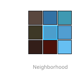
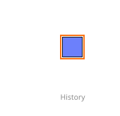
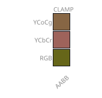

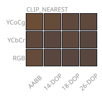
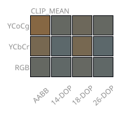
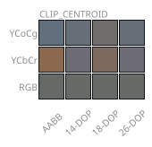
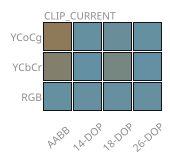

<small>Legend: each image is a separate asset (reorder or restyle in CSS). Neighborhood · history · then one matrix per <code>TFAA_RECTIFY_OP</code>. <strong>CLAMP</strong> uses rows = <strong>YCoCg</strong>, <strong>YCbCr</strong>, <strong>RGB</strong> and a single <strong>AABB</strong> column (shape ignored for clamp). <strong>CLIP</strong> ops use rows = rectify color space (<strong>YCoCg</strong> visible by default; <strong>YCbCr</strong> and <strong>RGB</strong> under <code>&lt;details&gt;</code>) and columns = AABB / 14-DOP / 18-DOP / 26-DOP. A stacked all-in-one graphic is still emitted as <code>key_clipped_&lt;theme&gt;.svg</code> for convenience.</small>

---

### **CLAMP (`TFAA_RECTIFY_OP` 0)** 
Per-channel clamp to the neighborhood **AABB** in the chosen rectify color space. <code>TFAA_RECTIFY_SHAPE</code> is ignored for clamp, so every shape collapses to the same feasible set; this table compares <strong>no rectification</strong> against clamping in the different rectification color spaces.

<table width="100%" style="width:100%;table-layout:fixed;border-collapse:collapse;">
<tr>
<th>None</th><th>RGB</th><th>YCbCr</th><th>YCoCg</th></tr>
<tr>
<td style="vertical-align:top;padding:4px;">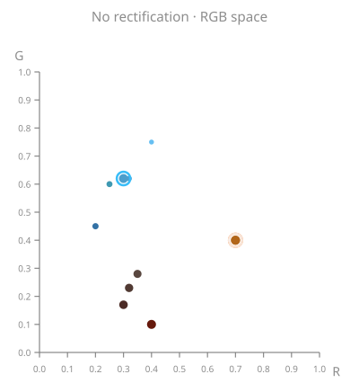</td>
<td style="vertical-align:top;padding:4px;"></td>
<td style="vertical-align:top;padding:4px;"></td>
<td style="vertical-align:top;padding:4px;">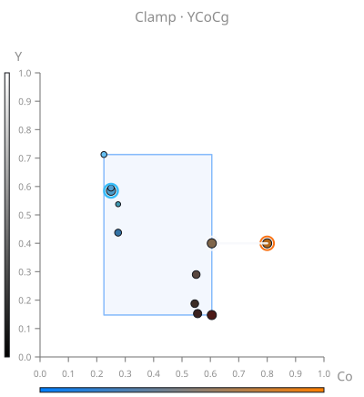</td>
</tr>
</table>

---
 

### **CLIP_NEAREST (`TFAA_RECTIFY_OP` 1)** 
Ray-clip from the **neighbor tap closest to history** in rectify space (Euclidean), after the 3×3 neighborhood is accumulated.
#### **YCoCg**
<table width="100%" style="width:100%;table-layout:fixed;border-collapse:collapse;">
<tr>
<th>AABB</th><th>14-DOP</th><th>18-DOP</th><th>26-DOP</th>
</tr>
<tr>
<td style="vertical-align:top;padding:4px;">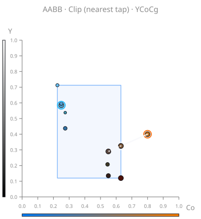</td>
<td style="vertical-align:top;padding:4px;">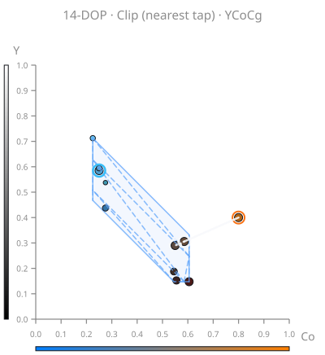</td>
<td style="vertical-align:top;padding:4px;"></td>
<td style="vertical-align:top;padding:4px;">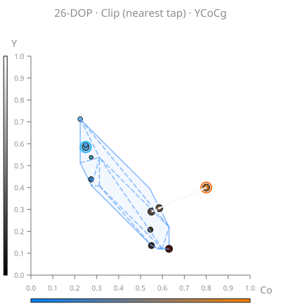</td>
</tr>
</table>

<strong>YCbCr &amp; RGB</strong> — click to expand

<table width="100%" style="width:100%;table-layout:fixed;border-collapse:collapse;">
<tr>
<th>AABB</th><th>14-DOP</th><th>18-DOP</th><th>26-DOP</th>
</tr>
<tr>
<td style="vertical-align:top;padding:4px;">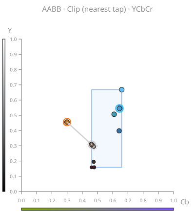</td>
<td style="vertical-align:top;padding:4px;">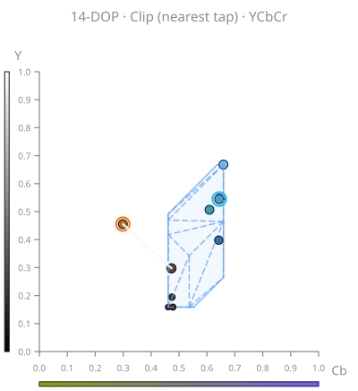</td>
<td style="vertical-align:top;padding:4px;">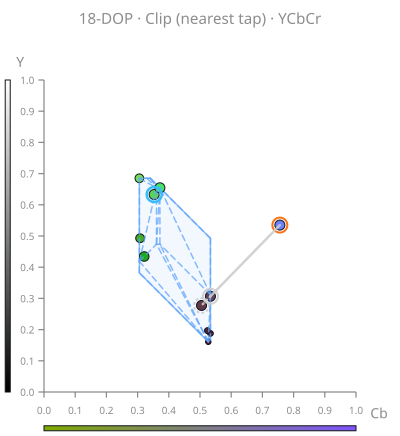</td>
<td style="vertical-align:top;padding:4px;">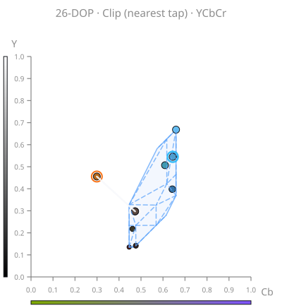</td>
</tr>
<tr>
<td style="vertical-align:top;padding:4px;">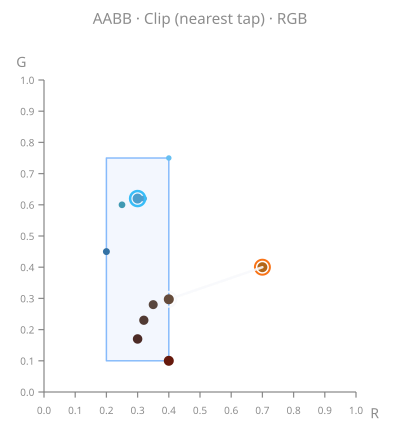</td>
<td style="vertical-align:top;padding:4px;">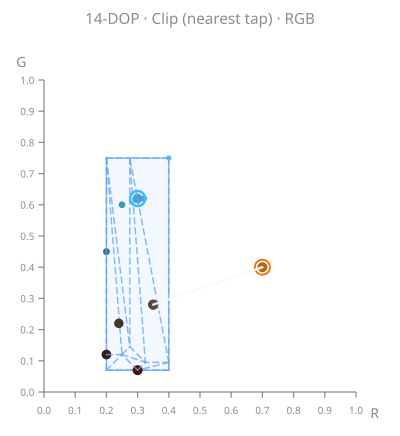</td>
<td style="vertical-align:top;padding:4px;">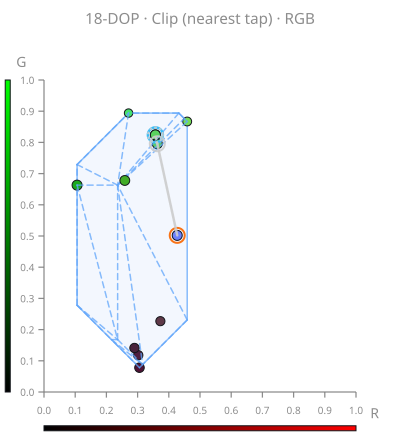</td>
<td style="vertical-align:top;padding:4px;">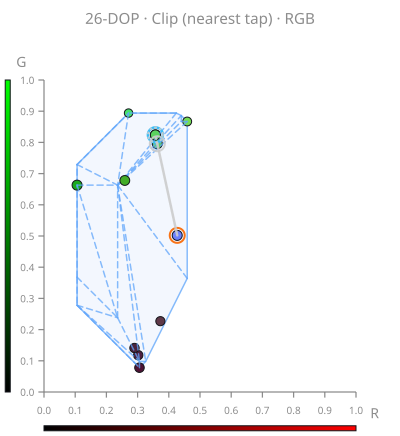</td>
</tr>
</table>

---
 

### **CLIP_MEAN (`TFAA_RECTIFY_OP` 2)** 
Ray-clip from the **nine-tap arithmetic mean** of the neighborhood in rectify space.

#### **YCoCg**
<table width="100%" style="width:100%;table-layout:fixed;border-collapse:collapse;">
<tr>
<th>AABB</th><th>14-DOP</th><th>18-DOP</th><th>26-DOP</th>
</tr>
<tr>
<td style="vertical-align:top;padding:4px;">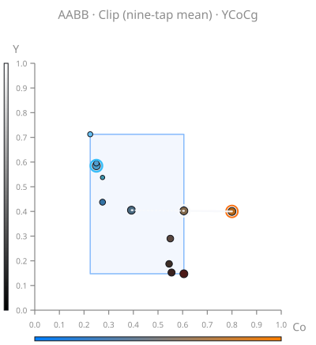</td>
<td style="vertical-align:top;padding:4px;">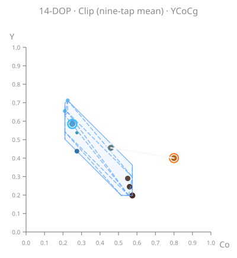</td>
<td style="vertical-align:top;padding:4px;">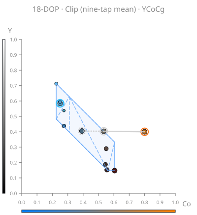</td>
<td style="vertical-align:top;padding:4px;">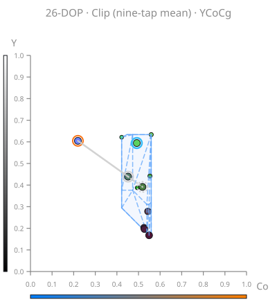</td>
</tr>
</table>

<strong>YCbCr &amp; RGB</strong> — click to expand

<table width="100%" style="width:100%;table-layout:fixed;border-collapse:collapse;">
<tr>
<th>AABB</th><th>14-DOP</th><th>18-DOP</th><th>26-DOP</th>
</tr>
<tr>
<td style="vertical-align:top;padding:4px;">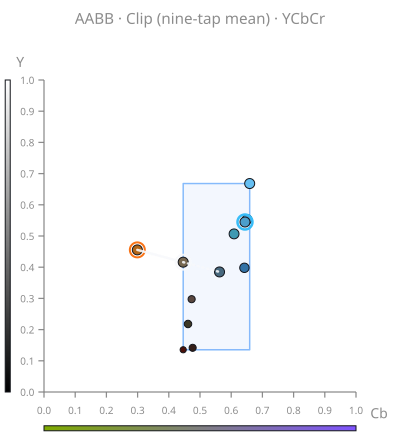</td>
<td style="vertical-align:top;padding:4px;">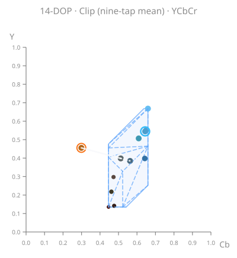</td>
<td style="vertical-align:top;padding:4px;"></td>
<td style="vertical-align:top;padding:4px;">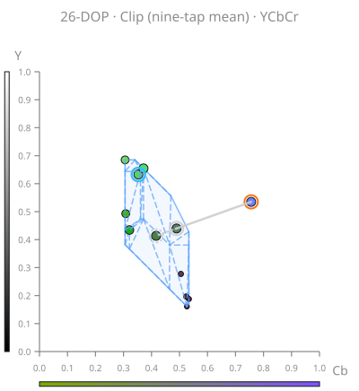</td>
</tr>
<tr>
<td style="vertical-align:top;padding:4px;">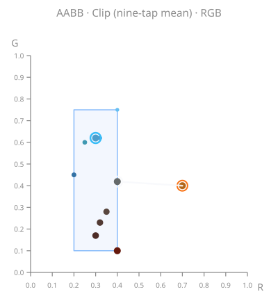</td>
<td style="vertical-align:top;padding:4px;">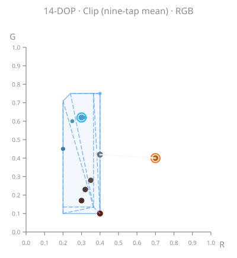</td>
<td style="vertical-align:top;padding:4px;">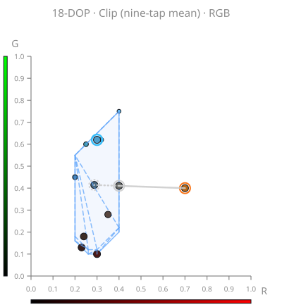</td>
<td style="vertical-align:top;padding:4px;">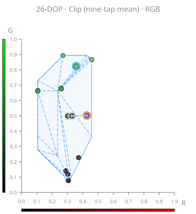</td>
</tr>
</table>

---
 

### **CLIP_CENTROID (`TFAA_RECTIFY_OP` 3)** 
Ray-clip from the per-channel **AABB midpoint** `(min+max)/2` in rectify space (not the nine-tap mean).

#### **YCoCg**
<table width="100%" style="width:100%;table-layout:fixed;border-collapse:collapse;">
<tr>
<th>AABB</th><th>14-DOP</th><th>18-DOP</th><th>26-DOP</th>
</tr>
<tr>
<td style="vertical-align:top;padding:4px;">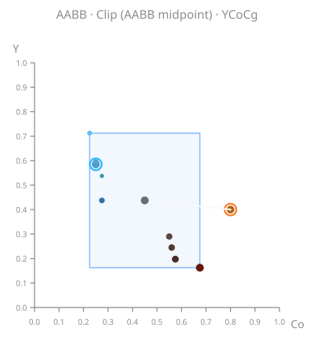</td>
<td style="vertical-align:top;padding:4px;">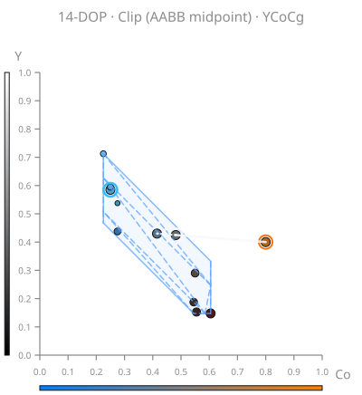</td>
<td style="vertical-align:top;padding:4px;">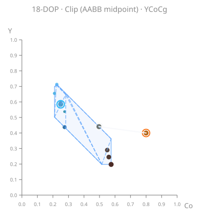</td>
<td style="vertical-align:top;padding:4px;">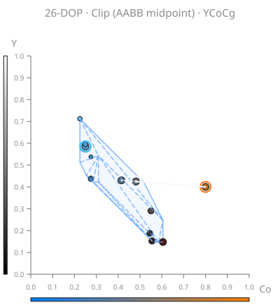</td>
</tr>
</table>

<strong>YCbCr &amp; RGB</strong> — click to expand

<table width="100%" style="width:100%;table-layout:fixed;border-collapse:collapse;">
<tr>
<th>AABB</th><th>14-DOP</th><th>18-DOP</th><th>26-DOP</th>
</tr>
<tr>
<td style="vertical-align:top;padding:4px;"></td>
<td style="vertical-align:top;padding:4px;">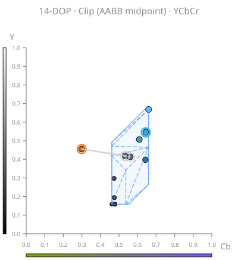</td>
<td style="vertical-align:top;padding:4px;">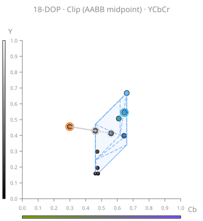</td>
<td style="vertical-align:top;padding:4px;">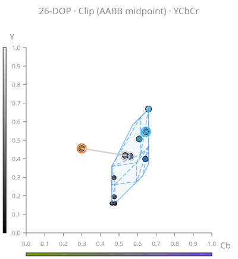</td>
</tr>
<tr>
<td style="vertical-align:top;padding:4px;">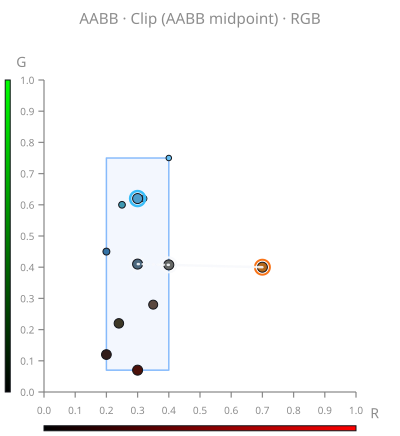</td>
<td style="vertical-align:top;padding:4px;">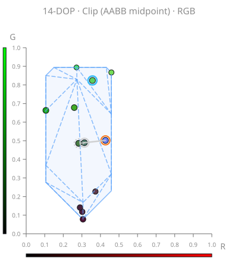</td>
<td style="vertical-align:top;padding:4px;">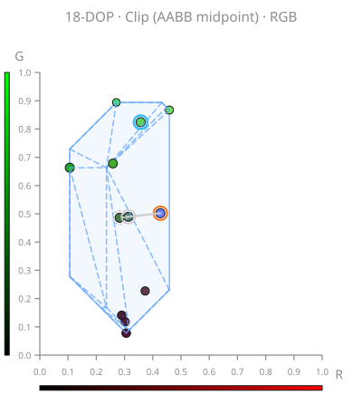</td>
<td style="vertical-align:top;padding:4px;">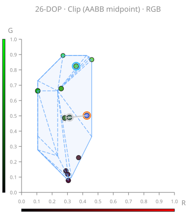</td>
</tr>
</table>

---
 

### **CLIP_CURRENT (`TFAA_RECTIFY_OP` 4)** 
Ray-clip from the **center tap** (current UV) toward history; this is the in-repo **default** (`TFAA_RECTIFY_OP` 4).

#### **YCoCg**
<table width="100%" style="width:100%;table-layout:fixed;border-collapse:collapse;">
<tr>
<th>AABB</th><th>14-DOP</th><th>18-DOP</th><th>26-DOP</th>
</tr>
<tr>
<td style="vertical-align:top;padding:4px;">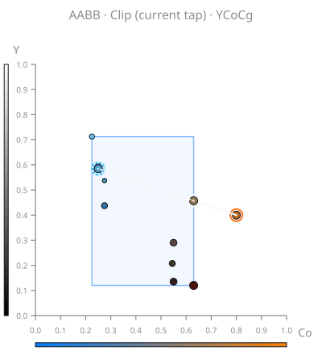</td>
<td style="vertical-align:top;padding:4px;">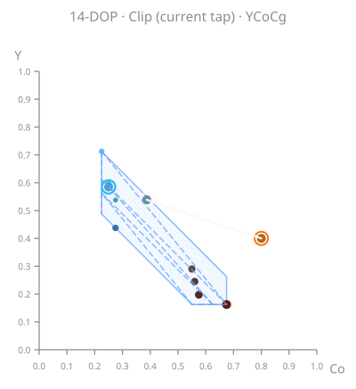</td>
<td style="vertical-align:top;padding:4px;"></td>
<td style="vertical-align:top;padding:4px;">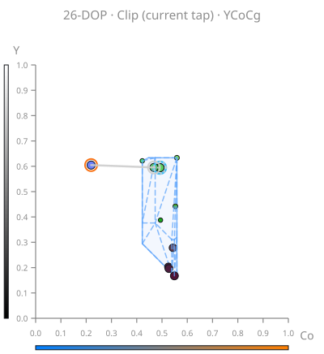</td>
</tr>
</table>

<strong>YCbCr &amp; RGB</strong> — click to expand

<table width="100%" style="width:100%;table-layout:fixed;border-collapse:collapse;">
<tr>
<th>AABB</th><th>14-DOP</th><th>18-DOP</th><th>26-DOP</th>
</tr>
<tr>
<td style="vertical-align:top;padding:4px;">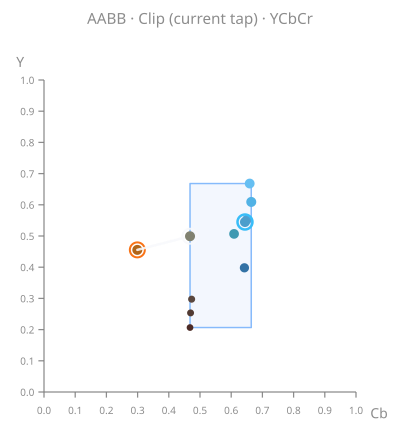</td>
<td style="vertical-align:top;padding:4px;">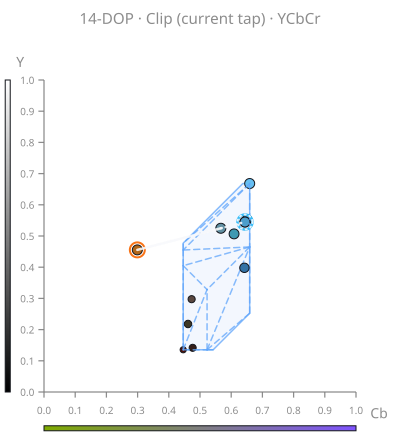</td>
<td style="vertical-align:top;padding:4px;">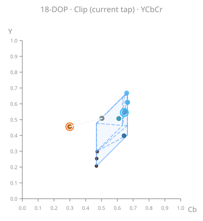</td>
<td style="vertical-align:top;padding:4px;">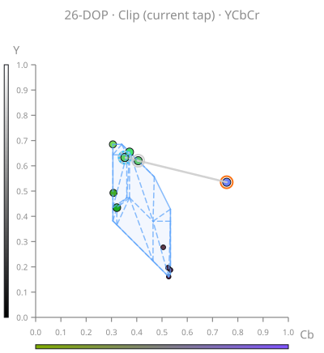</td>
</tr>
<tr>
<td style="vertical-align:top;padding:4px;">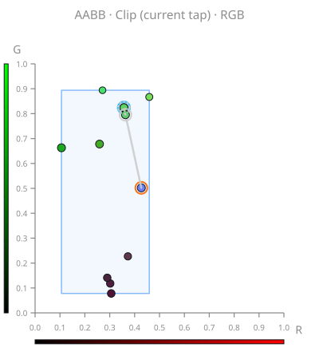</td>
<td style="vertical-align:top;padding:4px;"></td>
<td style="vertical-align:top;padding:4px;"></td>
<td style="vertical-align:top;padding:4px;"></td>
</tr>
</table>

---
 

# LICENSE
- License File: [LICENSE.md](./LICENSE.md)
- Human-readable summary of the License: https://creativecommons.org/licenses/by-nc-nd/4.0/
- Full legal code: https://creativecommons.org/licenses/by-nc-nd/4.0/legalcode