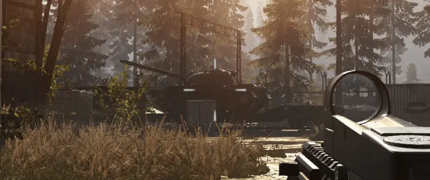
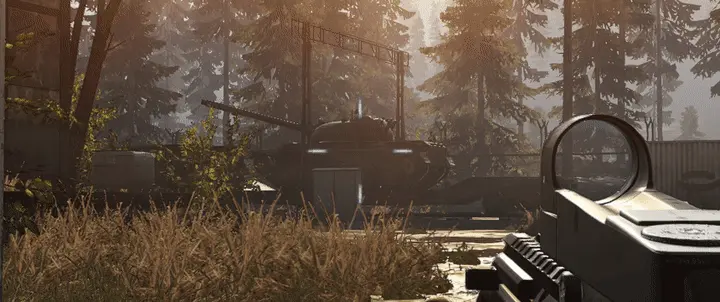

# Shades
Shades is a collection of my updated ReShade shaders. 
For now only the shades_TFAA.fx shader has been updated.

<!-- README_TOC_START -->
## Table of contents

- [Shades](#shades)
  - [Dependencies](#dependencies)
  - [Installation](#installation)
    - [A. ReShade installer](#a-reshade-installer)
    - [B. Manual](#b-manual)
    - [For both](#for-both)
- [shades_TFAA.fx 2.0](#shadestfaafx-20)
  - [What it is](#what-it-is)
  - [Compatible Spatial Anti-Aliasing Methods (selection, non exclusive)](#compatible-spatial-anti-aliasing-methods-selection-non-exclusive)
  - [Examples of non-compatible Anti-Aliasing Methods](#examples-of-non-compatible-anti-aliasing-methods)
  - [How it works](#how-it-works)
  - [Runtime Settings](#runtime-settings)
  - [Preprocessor Controls.](#preprocessor-controls)
  - [History Resampling](#history-resampling)
  - [History Validation](#history-validation)
  - [History Rectification](#history-rectification)
- [LICENSE](#license)
  - [Changelog](#changelog)
    - [2.0.1](#201)
    - [2.0](#20)
- [References](#references)
- [Figures and assets](#figures-and-assets)
<!-- README_TOC_END -->

## **Dependencies**
- [ReShade](https://reshade.me/) being installed and configured correctly.
- The **depth buffer** being available and configured correctly. (Check via DisplayDepth.fx)
- [iMMERSE LAUNCHPAD](https://github.com/martymcmodding/iMMERSE/blob/main/Shaders/MartysMods_LAUNCHPAD.fx) or [Lumenite Kernel](https://github.com/umar-afzaal/LumeniteFX/blob/mainline/Shaders/lumenite_Kernel.fx) being installed with all its dependencies. (Just install one of the two shader packs via the ReShade installer.)
- Some **spatial anti-aliasing** method being run either in-game or via ReShade **before TFAA**.

## **Installation**
### A. ReShade installer
1. Run the [ReShade](https://reshade.me/) installer.
2. Select your target game.
3. Select the correct rendering API (DirectX 9, 10, 11, 12, OpenGL or Vulkan).
4. If you already have ReShade installed for that game, select: `Update ReShade and Effects`.
5. Toggle the checkmark on `Shades`.
6. Click on next or continue to install.
### B. Manual 
If ReShade is already installed for that game, you can install the shaders manually by:
1. Locating the game's executable `.exe` file. Next to it you will find a folder named `./reshade-shaders` with subfolders `/Shaders` and `/Textures`.
2. Download the whole repo and drop the `/Shaders` and `/Textures` folders into the `./reshade-shaders` folder.
3. In the ReShade settings add the `/Shaders/Shades` and `/Textures/Shades` folders to the "Texture Search Paths" and "Effect Search Paths" respectively.

### For both
Make sure either iMMERSE LAUNCHPAD or Lumenite Kernel is activated an ontop/before TFAA. Spatial anti-aliasing must be run before TFAA in the shader chain.

# **shades_TFAA.fx**  *2.0*
## **What it is**
**TFAA** is a purely temporal anti-aliasing component, used to get the closest thing to real temporal anti-aliasing possible in a [ReShade](https://reshade.me/) shader.

<!-- TFAA_EXMAPLE_VIDEO_START -->

*Top: SMAA · Bottom: SMAA + TFAA*

<!-- TFAA_EXMAPLE_VIDEO_END -->

**TFAA** does not anti-alias static edges on its own. It only accumulates signal across frames to produce a cleaner, more stable image over time.
That is why spatial anti-aliasing still matters. It handles edges that stay still on screen, and on motion the best order is spatial first, then **TFAA** to stabilize over time.

Pair **TFAA** with any in-game anti-aliasing that preserves depth buffer access, or with any spatial ReShade AA shader loaded before it in the chain.

## Compatible Spatial Anti-Aliasing Methods (selection, non exclusive)

- $\color{green}{\textsf{Post Anti-Aliasing}}$  Whatever is listed as *"Post Anti-Aliasing"* in the game's settings should work, as long as it does not have a temporal component.
- $\color{green}{\textsf{FXAA}}$ [Fast Approximate Anti-Aliasing](https://developer.download.nvidia.com/assets/gamedev/files/sdk/11/FXAA_WhitePaper.pdf)
- $\color{green}{\textsf{MLAA}}$ [Morphological Anti-Aliasing](https://www.cs.cmu.edu/afs/cs/academic/class/15869-f11/www/readings/reshetov09_mlaa.pdf)
- $\color{green}{\textsf{CMAA}}$ [Conservative Morphological Anti-Aliasing](https://www.intel.com/content/www/us/en/developer/articles/technical/conservative-morphological-anti-aliasing-20.html)
- $\color{green}{\textsf{SMAA}}$ [Subpixel Morphological Anti-Aliasing](https://www.iryoku.com/smaa/downloads/SMAA-Enhanced-Subpixel-Morphological-Antialiasing.pdf) — Only ones that do not already include a temporal component
    - These ones make sense to use with TFAA:
        - $\color{green}{\textsf{SMAA}}$ - *Original*
        - $\color{green}{\textsf{SMAA}}$ **1x** - *Same as "SMAA"*
    - These ones do not:
        - $\color{red}{\textsf{SMAA}}$ **s2x** - *2x Spatial supersampling* 
        - $\color{red}{\textsf{SMAA}}$ **t2x** - *2x Temporal supersampling*
        - $\color{red}{\textsf{SMAA}}$ **4x** - *2x Spatial + 2x Temporal supersampling*
        - $\color{red}{\textsf{Filmic SMAA}}$ **1x** - *1x Temporal Filtering*
        - $\color{red}{\textsf{Filmic SMAA}}$ **t2x** - *2x Temporal supersampling + temporal filtering*
        - $\color{red}{\textsf{Filmic SMAA}}$ **TU2x** - *2x Temporal Upsampling + temporal filtering*
        - $\color{red}{\textsf{Filmic SMAA}}$ **TU4x** - *4x Temporal Upsampling + temporal filtering*

## Examples of non-compatible Anti-Aliasing Methods
- $\color{red}{\textsf{MSAA}}$ Makes Depth buffer not stably accessible most of the time.
- $\color{red}{\textsf{SSAA}}$ Makes Depth buffer not stably accessible most of the time.
- $\color{red}{\textsf{NVIDIA DSR}}$ Always makes depth buffer have the wrong scale, often makes it jitter and is not stably accessible.
- $\color{red}{\textsf{TAA}}$ Already includes temporal component. Jittering depth buffer, often makes it not stably accessible.
- $\color{red}{\textsf{TUAA}}$ Already includes temporal component. Jittering depth buffer, wrong scale, often makes it not stably accessible.
- $\color{red}{\textsf{TXAA}}$ Same problems as MSAA and TAA combined

Below you can see how TFAA and SMAA can work together on edges in motion.

<!-- TFAA_EXMAPLE_Images_START -->
<table width="100%" style="width:100%;table-layout:fixed;border-collapse:collapse;">
<tr>
<th width="18%" style="width:18%;"></th>
<th width="41%" style="width:41%;">Without SMAA</th>
<th width="41%" style="width:41%;">With SMAA</th>
</tr>
<tr>
<th align="left" valign="middle" style="text-align:left;vertical-align:middle;">Without TFAA</th>
<td valign="top" style="vertical-align:top;padding:4px;"></td>
<td valign="top" style="vertical-align:top;padding:4px;"></td>
</tr>
<tr>
<th align="left" valign="middle" style="text-align:left;vertical-align:middle;">With TFAA</th>
<td valign="top" style="vertical-align:top;padding:4px;"></td>
<td valign="top" style="vertical-align:top;padding:4px;"></td>
</tr>
</table>
<!-- TFAA_EXMAPLE_Images_END -->

## **How it works**
The most basic version of a temporal filter as in TFAA or in well-known industry solutions like Filmic SMAA T1x consists of the following steps:
1. [**History data** is sampled](#history-resampling) for each pixel using the **velocity buffer** and an accumulated **history buffer**.
2. [**Validate**](#history-validation) that history data is plausible and reject if not.
3. [**Rectify**](#history-rectification) history data to the neighborhood of the current frame.
4. **Blend** new frame data with the rectified history data.
5. **Write** blended data to the history buffer.

## **Runtime Settings**
ReShade UI controls (runtime). Edit **Description** here, then run `py -3 misc/sync_tfaa_tooltip.py`.

|  |  |  |  |
|:-|:-|:-|:-|
| [**`UI_TEMPORAL_FILTER_STRENGTH`**]() | [**Label**]() | [**Range**]() | [**Description**]() |
|  | *Temporal Filter Strength* | *0–1* | Strength of the temporal filter.|
|  |  |  |  |
| [**`UI_ADAPTIVE_SHARPEN`**]() | [**Label**]() | [**Range**]() | [**Description**]() |
|  | *Adaptive Sharpening* | *0–1* | Amount of adaptive sharpening applied to cancel out temporal blurring where necessary. |
|  |  |  |  |
| [**`UI_POST_SHARPEN`**]() | [**Label**]() | [**Range**]() | [**Description**]() |
|  | *Post Sharpening* | *0–1* | Amount of post-sharpening applied to the whole image. |
|  |  |  |  |

## **Preprocessor Controls**. 
These settings are implemented as preprocessor defines instead of runtime branching for performance reasons.

|  |  |  |  |
|:-|:-|:-|:-|
| [**`TFAA_SAMPLING_METHOD`**](#history-resampling) | [**Value**]() | [**Samples**]() | [**Description**]() |
| *BILINEAR* | *`0`* | 1-tap | Hardware [bilinear](https://en.wikipedia.org/wiki/Bilinear_interpolation) tap |
| *LANCZOS2_5TAP* | *`1`* | 5-tap | [Lanczos-2](https://en.wikipedia.org/wiki/Lanczos_resampling) fast (corners omitted) |
| *LANCZOS2_9TAP* | *`2`* | 9-tap | [Lanczos-2](https://en.wikipedia.org/wiki/Lanczos_resampling) full optimized merge |
| *LANCZOS3* | *`3`* | 25-tap | [Lanczos-3](https://en.wikipedia.org/wiki/Lanczos_resampling) full optimized merge |
| *LANCZOS4* | *`4`* | 49-tap | [Lanczos-4](https://en.wikipedia.org/wiki/Lanczos_resampling) full optimized merge |
| **CATMULLROM_5TAP** | **`5`** | 5-tap | [Catmull-Rom](https://en.wikipedia.org/wiki/Catmull%E2%80%93Rom_spline) fast (corners omitted)  |
| *CATMULLROM_9TAP* | *`6`* | 9-tap | [Catmull-Rom](https://en.wikipedia.org/wiki/Catmull%E2%80%93Rom_spline) |
| *FSR EASU* ($\color{red}{\textsf{BROKEN}}$) | *`7`* | 12-tap | [AMD FidelityFX EASU](https://github.com/GPUOpen-Effects/FidelityFX-FSR) |
|  |  |  |
| [**`TFAA_RECTIFY_COLOR_SPACE`**](#color-rectification-visualization) | [**Value**]() | [**Channels**]() | [**Description**]() |
| *RGB* | *`0`* | **R**: $\color{red}{\textsf{Red}}$ **G**: $\color{green}{\textsf{Green}}$ **B**: $\color{blue}{\textsf{Blue}}$ | No color transform (identity); loosest rectification bounds. Most blurring and most color deviation artifacts.|
| *YCbCr* | *`1`* | **Y**: BT.601 $\color{white}{\textsf{luma}}$ **Cb**: $\color{blue}{\textsf{blue}}\text{-}\color{yellow}{\textsf{yellow}}$ **Cr**: $\color{red}{\textsf{red}}\text{-}\color{cyan}{\textsf{cyan}}$ | ITU-R BT.601 / JPEG-style full-range chroma scales (not broadcast limited-range packing). Chrominance more correlated across axes than YCoCg. Rectify path stores Cb/Cr with **+0.5** offset so all axes are in [0,1]. |
| **YCoCg** | **`2`** | **Y**: (R+2G+B)/4 $\color{white}{\textsf{luma}}$ **Co**: $\color{orange}{\textsf{orange}}\text{-}\color{cyan}{\textsf{cyan}}$ **Cg**: $\color{green}{\textsf{green}}\text{-}\color{magenta}{\textsf{magenta}}$ | Malvar & Sullivan (2003 YCoCg); orthogonal chroma, more decorrelated than YCbCr. Rectify path stores Co/Cg with **+0.5** offset so all axes are in [0,1]. |
|  |  |  |
| [**`TFAA_RECTIFY_OP`**](#history-rectification) | [**Value**]() |  | [**Description**]() |
| *CLAMP*         | *`0`* |   | Clamp history to the AABB. (**`TFAA_RECTIFY_SHAPE`** is ignored). |  |
| *CLIP_NEAREST*  | *`1`* |  | Ray clip towards neighborhood sample **closest** to history in rectification space. |  |
| *CLIP_MEAN*     | *`2`* |  | Ray clip towards the nine-tap arithmetic **average**. |  |
| *CLIP_CENTROID* | *`3`* |  | Ray clip towards the per-channel **midpoint** `(min+max)/2`. |  |
| **CLIP_CURRENT**  | **`4`** |  | Ray clip towards the **current** pixel. |  |
|  |  |  |
| [**`TFAA_RECTIFY_SHAPE`**](#history-rectification) | [**Value**]() |  | [**Description**]() |
| *AABB* | *`0`* |  | **3**-axis \| **6**-faces Box - classic axis-aligned box used for clipping/clamping in common industry TAA solutions. |  |
| **14-DOP** | **`1`** |  | **7**-axis \| **14** - faces \| Box with cut corners.  |  |
| *18-DOP* | *`2`* |  | **9**-axis \| **18** - faces \| Box with cut edges.  |  |
| *26-DOP* | *`3`* |  | **13**-axis \| **26** - faces \| Box with cut corners and edges.  |
|  |  |  |
| [**`TFAA_MOTION_SOURCE`**](#how-it-works) | [**Value**]() |  | [**Description**]() |
| **LAUNCHPAD**     | **`0`** |  | Uses MartysMods_LAUNCHPAD.fx |
| *LUMENITE_KERNEL* |  *`1`*  |  | Uses  lumenite_Kernel.fx |
|  |  |  |

 

## History Resampling

History is not read at integer pixel coordinates. After motion, the sample point usually falls between texels at a **subpixel offset**.

**Resampling** is how we fill in that in-between value, and the choice of filter sets the tradeoff. Lighter filters smooth more; heavier ones hold edges and fine detail at the risk of extra artifacts when the sample straddles discontinuities.

The table below shows several filters at offsets 0.125, 0.25, and 0.5.

<!-- RESAMPLE_TABLE_START -->
<table width="100%" style="width:100%;table-layout:fixed;border-collapse:collapse;">
<tr>
<th width="14%" style="width:14%;"></th>
<th width="21.5%">0.0 offset</th>
<th width="21.5%">0.125</th>
<th width="21.5%">0.25</th>
<th width="21.5%">0.5</th>
</tr>
<tr>
<th align="left" valign="middle" style="text-align:left;vertical-align:middle;white-space:normal;">Bilinear 1 tap</th>
<td valign="top" style="vertical-align:top;padding:4px;"></td>
<td valign="top" style="vertical-align:top;padding:4px;"></td>
<td valign="top" style="vertical-align:top;padding:4px;"></td>
<td valign="top" style="vertical-align:top;padding:4px;"></td>
</tr>
<tr>
<th align="left" valign="middle" style="text-align:left;vertical-align:middle;white-space:normal;">Lanczos-2 5-tap 5 taps</th>
<td valign="top" style="vertical-align:top;padding:4px;"></td>
<td valign="top" style="vertical-align:top;padding:4px;"></td>
<td valign="top" style="vertical-align:top;padding:4px;"></td>
<td valign="top" style="vertical-align:top;padding:4px;"></td>
</tr>
<tr>
<th align="left" valign="middle" style="text-align:left;vertical-align:middle;white-space:normal;">Lanczos-2 9-tap 9 taps</th>
<td valign="top" style="vertical-align:top;padding:4px;"></td>
<td valign="top" style="vertical-align:top;padding:4px;"></td>
<td valign="top" style="vertical-align:top;padding:4px;"></td>
<td valign="top" style="vertical-align:top;padding:4px;"></td>
</tr>
<tr>
<th align="left" valign="middle" style="text-align:left;vertical-align:middle;white-space:normal;">Lanczos-3 25 taps</th>
<td valign="top" style="vertical-align:top;padding:4px;"></td>
<td valign="top" style="vertical-align:top;padding:4px;"></td>
<td valign="top" style="vertical-align:top;padding:4px;"></td>
<td valign="top" style="vertical-align:top;padding:4px;"></td>
</tr>
<tr>
<th align="left" valign="middle" style="text-align:left;vertical-align:middle;white-space:normal;">Lanczos-4 49 taps</th>
<td valign="top" style="vertical-align:top;padding:4px;"></td>
<td valign="top" style="vertical-align:top;padding:4px;"></td>
<td valign="top" style="vertical-align:top;padding:4px;"></td>
<td valign="top" style="vertical-align:top;padding:4px;"></td>
</tr>
<tr>
<th align="left" valign="middle" style="text-align:left;vertical-align:middle;white-space:normal;">Catmull-Rom 5-tap 5 taps</th>
<td valign="top" style="vertical-align:top;padding:4px;"></td>
<td valign="top" style="vertical-align:top;padding:4px;"></td>
<td valign="top" style="vertical-align:top;padding:4px;"></td>
<td valign="top" style="vertical-align:top;padding:4px;"></td>
</tr>
<tr>
<th align="left" valign="middle" style="text-align:left;vertical-align:middle;white-space:normal;">Catmull-Rom 9-tap 9 taps</th>
<td valign="top" style="vertical-align:top;padding:4px;"></td>
<td valign="top" style="vertical-align:top;padding:4px;"></td>
<td valign="top" style="vertical-align:top;padding:4px;"></td>
<td valign="top" style="vertical-align:top;padding:4px;"></td>
</tr>
<tr>
<th align="left" valign="middle" style="text-align:left;vertical-align:middle;white-space:normal;">FSR EASU 12 taps</th>
<td valign="top" style="vertical-align:top;padding:4px;"></td>
<td valign="top" style="vertical-align:top;padding:4px;"></td>
<td valign="top" style="vertical-align:top;padding:4px;"></td>
<td valign="top" style="vertical-align:top;padding:4px;"></td>
</tr>
</table>

<strong>Show more examples</strong> - click to expand

<table width="100%" style="width:100%;table-layout:fixed;border-collapse:collapse;">
<tr>
<th width="14%" style="width:14%;"></th>
<th width="21.5%">0.0 offset</th>
<th width="21.5%">0.125</th>
<th width="21.5%">0.25</th>
<th width="21.5%">0.5</th>
</tr>
<tr>
<th align="left" valign="middle" style="text-align:left;vertical-align:middle;white-space:normal;">Bilinear 1 tap</th>
<td valign="top" style="vertical-align:top;padding:4px;"></td>
<td valign="top" style="vertical-align:top;padding:4px;"></td>
<td valign="top" style="vertical-align:top;padding:4px;"></td>
<td valign="top" style="vertical-align:top;padding:4px;"></td>
</tr>
<tr>
<th align="left" valign="middle" style="text-align:left;vertical-align:middle;white-space:normal;">Lanczos-2 5-tap 5 taps</th>
<td valign="top" style="vertical-align:top;padding:4px;"></td>
<td valign="top" style="vertical-align:top;padding:4px;"></td>
<td valign="top" style="vertical-align:top;padding:4px;"></td>
<td valign="top" style="vertical-align:top;padding:4px;"></td>
</tr>
<tr>
<th align="left" valign="middle" style="text-align:left;vertical-align:middle;white-space:normal;">Lanczos-2 9-tap 9 taps</th>
<td valign="top" style="vertical-align:top;padding:4px;"></td>
<td valign="top" style="vertical-align:top;padding:4px;"></td>
<td valign="top" style="vertical-align:top;padding:4px;"></td>
<td valign="top" style="vertical-align:top;padding:4px;"></td>
</tr>
<tr>
<th align="left" valign="middle" style="text-align:left;vertical-align:middle;white-space:normal;">Lanczos-3 25 taps</th>
<td valign="top" style="vertical-align:top;padding:4px;"></td>
<td valign="top" style="vertical-align:top;padding:4px;"></td>
<td valign="top" style="vertical-align:top;padding:4px;"></td>
<td valign="top" style="vertical-align:top;padding:4px;"></td>
</tr>
<tr>
<th align="left" valign="middle" style="text-align:left;vertical-align:middle;white-space:normal;">Lanczos-4 49 taps</th>
<td valign="top" style="vertical-align:top;padding:4px;"></td>
<td valign="top" style="vertical-align:top;padding:4px;"></td>
<td valign="top" style="vertical-align:top;padding:4px;"></td>
<td valign="top" style="vertical-align:top;padding:4px;"></td>
</tr>
<tr>
<th align="left" valign="middle" style="text-align:left;vertical-align:middle;white-space:normal;">Catmull-Rom 5-tap 5 taps</th>
<td valign="top" style="vertical-align:top;padding:4px;"></td>
<td valign="top" style="vertical-align:top;padding:4px;"></td>
<td valign="top" style="vertical-align:top;padding:4px;"></td>
<td valign="top" style="vertical-align:top;padding:4px;"></td>
</tr>
<tr>
<th align="left" valign="middle" style="text-align:left;vertical-align:middle;white-space:normal;">Catmull-Rom 9-tap 9 taps</th>
<td valign="top" style="vertical-align:top;padding:4px;"></td>
<td valign="top" style="vertical-align:top;padding:4px;"></td>
<td valign="top" style="vertical-align:top;padding:4px;"></td>
<td valign="top" style="vertical-align:top;padding:4px;"></td>
</tr>
<tr>
<th align="left" valign="middle" style="text-align:left;vertical-align:middle;white-space:normal;">FSR EASU 12 taps</th>
<td valign="top" style="vertical-align:top;padding:4px;"></td>
<td valign="top" style="vertical-align:top;padding:4px;"></td>
<td valign="top" style="vertical-align:top;padding:4px;"></td>
<td valign="top" style="vertical-align:top;padding:4px;"></td>
</tr>
</table>

<table width="100%" style="width:100%;table-layout:fixed;border-collapse:collapse;">
<tr>
<th width="14%" style="width:14%;"></th>
<th width="21.5%">0.0 offset</th>
<th width="21.5%">0.125</th>
<th width="21.5%">0.25</th>
<th width="21.5%">0.5</th>
</tr>
<tr>
<th align="left" valign="middle" style="text-align:left;vertical-align:middle;white-space:normal;">Bilinear 1 tap</th>
<td valign="top" style="vertical-align:top;padding:4px;"></td>
<td valign="top" style="vertical-align:top;padding:4px;"></td>
<td valign="top" style="vertical-align:top;padding:4px;"></td>
<td valign="top" style="vertical-align:top;padding:4px;"></td>
</tr>
<tr>
<th align="left" valign="middle" style="text-align:left;vertical-align:middle;white-space:normal;">Lanczos-2 5-tap 5 taps</th>
<td valign="top" style="vertical-align:top;padding:4px;"></td>
<td valign="top" style="vertical-align:top;padding:4px;"></td>
<td valign="top" style="vertical-align:top;padding:4px;"></td>
<td valign="top" style="vertical-align:top;padding:4px;"></td>
</tr>
<tr>
<th align="left" valign="middle" style="text-align:left;vertical-align:middle;white-space:normal;">Lanczos-2 9-tap 9 taps</th>
<td valign="top" style="vertical-align:top;padding:4px;"></td>
<td valign="top" style="vertical-align:top;padding:4px;"></td>
<td valign="top" style="vertical-align:top;padding:4px;"></td>
<td valign="top" style="vertical-align:top;padding:4px;"></td>
</tr>
<tr>
<th align="left" valign="middle" style="text-align:left;vertical-align:middle;white-space:normal;">Lanczos-3 25 taps</th>
<td valign="top" style="vertical-align:top;padding:4px;"></td>
<td valign="top" style="vertical-align:top;padding:4px;"></td>
<td valign="top" style="vertical-align:top;padding:4px;"></td>
<td valign="top" style="vertical-align:top;padding:4px;"></td>
</tr>
<tr>
<th align="left" valign="middle" style="text-align:left;vertical-align:middle;white-space:normal;">Lanczos-4 49 taps</th>
<td valign="top" style="vertical-align:top;padding:4px;"></td>
<td valign="top" style="vertical-align:top;padding:4px;"></td>
<td valign="top" style="vertical-align:top;padding:4px;"></td>
<td valign="top" style="vertical-align:top;padding:4px;"></td>
</tr>
<tr>
<th align="left" valign="middle" style="text-align:left;vertical-align:middle;white-space:normal;">Catmull-Rom 5-tap 5 taps</th>
<td valign="top" style="vertical-align:top;padding:4px;"></td>
<td valign="top" style="vertical-align:top;padding:4px;"></td>
<td valign="top" style="vertical-align:top;padding:4px;"></td>
<td valign="top" style="vertical-align:top;padding:4px;"></td>
</tr>
<tr>
<th align="left" valign="middle" style="text-align:left;vertical-align:middle;white-space:normal;">Catmull-Rom 9-tap 9 taps</th>
<td valign="top" style="vertical-align:top;padding:4px;"></td>
<td valign="top" style="vertical-align:top;padding:4px;"></td>
<td valign="top" style="vertical-align:top;padding:4px;"></td>
<td valign="top" style="vertical-align:top;padding:4px;"></td>
</tr>
<tr>
<th align="left" valign="middle" style="text-align:left;vertical-align:middle;white-space:normal;">FSR EASU 12 taps</th>
<td valign="top" style="vertical-align:top;padding:4px;"></td>
<td valign="top" style="vertical-align:top;padding:4px;"></td>
<td valign="top" style="vertical-align:top;padding:4px;"></td>
<td valign="top" style="vertical-align:top;padding:4px;"></td>
</tr>
</table>

<!-- RESAMPLE_TABLE_END -->

---
 

## History Validation
Once we fetch a sample from the history buffer, we still cannot assume it belongs to this pixel in the current frame—the scene may have moved, depth may disagree, or disocclusion may have exposed objects that were not there before.

Validation is the first gate before we reuse it: depth discontinuities and disocclusion checks decide whether that sample still plausibly matches this location. If it fails, the sample is discarded entirely and only the current frame contributes, which cuts ghosting when the history clearly comes from somewhere else.

## History Rectification
Even when validation says a history sample probably belongs to this pixel, we still cannot be sure it actually does.
We then have to choose how much to trust it: keep it as-is, or pull it toward what the surrounding image looks like now.
Rectification is that compromise - it reins in doubtful history instead of accepting it unchanged.

Tighter clamping and clipping yield a cleaner, sharper image with less ghosting and blur, but also less temporal stability, because plausible history that looks like an outlier gets pulled toward the neighborhood.
With rectification disabled, more detail accumulates and the image stays smoother, at the cost of trails and smear when history is wrong.
Different clip anchor targets bias that tradeoff differently (stability, temporal blur, sharpness, ghosting), which is why TFAA exposes several options.

<!-- RECTIFICATION_BASICS_START -->

<!-- RECTIFICATION_BASICS_END -->

<!-- RECTIFICATION_CLAMP_START -->
<table width="100%" style="width:100%;table-layout:fixed;border-collapse:collapse;">
<tr>
<th width="25%">None</th><th width="25%">RGB</th><th width="25%">YCbCr</th><th width="25%">YCoCg</th>
</tr>
<tr>
<td style="vertical-align:top;padding:4px;"></td><td style="vertical-align:top;padding:4px;"></td><td style="vertical-align:top;padding:4px;"></td><td style="vertical-align:top;padding:4px;"></td>
</tr>
</table>
<!-- RECTIFICATION_CLAMP_END -->

<!-- RECTIFICATION_CLIP_START -->
<table width="100%" style="width:100%;table-layout:fixed;border-collapse:collapse;">
<tr>
<th width="25%">None</th><th width="25%">RGB</th><th width="25%">YCbCr</th><th width="25%">YCoCg</th>
</tr>
<tr>
<td style="vertical-align:top;padding:4px;"></td><td style="vertical-align:top;padding:4px;"></td><td style="vertical-align:top;padding:4px;"></td><td style="vertical-align:top;padding:4px;"></td>
</tr>
</table>
<!-- RECTIFICATION_CLIP_END -->

<!-- RECTIFICATION_ALL_START -->

<strong>Show all rectification diagrams</strong> - click to expand

<strong>CLIP_NEAREST</strong> (<code>TFAA_RECTIFY_OP</code> 1)

<strong>YCoCg</strong>

<table width="100%" style="width:100%;table-layout:fixed;border-collapse:collapse;">
<tr>
<th width="25%">AABB</th><th width="25%">14-DOP</th><th width="25%">18-DOP</th><th width="25%">26-DOP</th>
</tr>
<tr>
<td style="vertical-align:top;padding:4px;"></td><td style="vertical-align:top;padding:4px;"></td><td style="vertical-align:top;padding:4px;"></td><td style="vertical-align:top;padding:4px;"></td>
</tr>
</table>

<strong>YCbCr &amp; RGB</strong> - click to expand

<strong>YCbCr</strong>

<table width="100%" style="width:100%;table-layout:fixed;border-collapse:collapse;">
<tr>
<th width="25%">AABB</th><th width="25%">14-DOP</th><th width="25%">18-DOP</th><th width="25%">26-DOP</th>
</tr>
<tr>
<td style="vertical-align:top;padding:4px;"></td><td style="vertical-align:top;padding:4px;"></td><td style="vertical-align:top;padding:4px;"></td><td style="vertical-align:top;padding:4px;"></td>
</tr>
</table>

<strong>RGB</strong>

<table width="100%" style="width:100%;table-layout:fixed;border-collapse:collapse;">
<tr>
<th width="25%">AABB</th><th width="25%">14-DOP</th><th width="25%">18-DOP</th><th width="25%">26-DOP</th>
</tr>
<tr>
<td style="vertical-align:top;padding:4px;"></td><td style="vertical-align:top;padding:4px;"></td><td style="vertical-align:top;padding:4px;"></td><td style="vertical-align:top;padding:4px;"></td>
</tr>
</table>

<strong>CLIP_MEAN</strong> (<code>TFAA_RECTIFY_OP</code> 2)

<strong>YCoCg</strong>

<table width="100%" style="width:100%;table-layout:fixed;border-collapse:collapse;">
<tr>
<th width="25%">AABB</th><th width="25%">14-DOP</th><th width="25%">18-DOP</th><th width="25%">26-DOP</th>
</tr>
<tr>
<td style="vertical-align:top;padding:4px;"></td><td style="vertical-align:top;padding:4px;"></td><td style="vertical-align:top;padding:4px;"></td><td style="vertical-align:top;padding:4px;"></td>
</tr>
</table>

<strong>YCbCr &amp; RGB</strong> - click to expand

<strong>YCbCr</strong>

<table width="100%" style="width:100%;table-layout:fixed;border-collapse:collapse;">
<tr>
<th width="25%">AABB</th><th width="25%">14-DOP</th><th width="25%">18-DOP</th><th width="25%">26-DOP</th>
</tr>
<tr>
<td style="vertical-align:top;padding:4px;"></td><td style="vertical-align:top;padding:4px;"></td><td style="vertical-align:top;padding:4px;"></td><td style="vertical-align:top;padding:4px;"></td>
</tr>
</table>

<strong>RGB</strong>

<table width="100%" style="width:100%;table-layout:fixed;border-collapse:collapse;">
<tr>
<th width="25%">AABB</th><th width="25%">14-DOP</th><th width="25%">18-DOP</th><th width="25%">26-DOP</th>
</tr>
<tr>
<td style="vertical-align:top;padding:4px;"></td><td style="vertical-align:top;padding:4px;"></td><td style="vertical-align:top;padding:4px;"></td><td style="vertical-align:top;padding:4px;"></td>
</tr>
</table>

<strong>CLIP_CENTROID</strong> (<code>TFAA_RECTIFY_OP</code> 3)

<strong>YCoCg</strong>

<table width="100%" style="width:100%;table-layout:fixed;border-collapse:collapse;">
<tr>
<th width="25%">AABB</th><th width="25%">14-DOP</th><th width="25%">18-DOP</th><th width="25%">26-DOP</th>
</tr>
<tr>
<td style="vertical-align:top;padding:4px;"></td><td style="vertical-align:top;padding:4px;"></td><td style="vertical-align:top;padding:4px;"></td><td style="vertical-align:top;padding:4px;"></td>
</tr>
</table>

<strong>YCbCr &amp; RGB</strong> - click to expand

<strong>YCbCr</strong>

<table width="100%" style="width:100%;table-layout:fixed;border-collapse:collapse;">
<tr>
<th width="25%">AABB</th><th width="25%">14-DOP</th><th width="25%">18-DOP</th><th width="25%">26-DOP</th>
</tr>
<tr>
<td style="vertical-align:top;padding:4px;"></td><td style="vertical-align:top;padding:4px;"></td><td style="vertical-align:top;padding:4px;"></td><td style="vertical-align:top;padding:4px;"></td>
</tr>
</table>

<strong>RGB</strong>

<table width="100%" style="width:100%;table-layout:fixed;border-collapse:collapse;">
<tr>
<th width="25%">AABB</th><th width="25%">14-DOP</th><th width="25%">18-DOP</th><th width="25%">26-DOP</th>
</tr>
<tr>
<td style="vertical-align:top;padding:4px;"></td><td style="vertical-align:top;padding:4px;"></td><td style="vertical-align:top;padding:4px;"></td><td style="vertical-align:top;padding:4px;"></td>
</tr>
</table>

<strong>CLIP_CURRENT</strong> (<code>TFAA_RECTIFY_OP</code> 4)

<strong>YCoCg</strong>

<table width="100%" style="width:100%;table-layout:fixed;border-collapse:collapse;">
<tr>
<th width="25%">AABB</th><th width="25%">14-DOP</th><th width="25%">18-DOP</th><th width="25%">26-DOP</th>
</tr>
<tr>
<td style="vertical-align:top;padding:4px;"></td><td style="vertical-align:top;padding:4px;"></td><td style="vertical-align:top;padding:4px;"></td><td style="vertical-align:top;padding:4px;"></td>
</tr>
</table>

<strong>YCbCr &amp; RGB</strong> - click to expand

<strong>YCbCr</strong>

<table width="100%" style="width:100%;table-layout:fixed;border-collapse:collapse;">
<tr>
<th width="25%">AABB</th><th width="25%">14-DOP</th><th width="25%">18-DOP</th><th width="25%">26-DOP</th>
</tr>
<tr>
<td style="vertical-align:top;padding:4px;"></td><td style="vertical-align:top;padding:4px;"></td><td style="vertical-align:top;padding:4px;"></td><td style="vertical-align:top;padding:4px;"></td>
</tr>
</table>

<strong>RGB</strong>

<table width="100%" style="width:100%;table-layout:fixed;border-collapse:collapse;">
<tr>
<th width="25%">AABB</th><th width="25%">14-DOP</th><th width="25%">18-DOP</th><th width="25%">26-DOP</th>
</tr>
<tr>
<td style="vertical-align:top;padding:4px;"></td><td style="vertical-align:top;padding:4px;"></td><td style="vertical-align:top;padding:4px;"></td><td style="vertical-align:top;padding:4px;"></td>
</tr>
</table>

<!-- RECTIFICATION_ALL_END -->

# LICENSE
- License File: [LICENSE.md](./LICENSE.md)
- Human-readable summary of the License: https://creativecommons.org/licenses/by-nc-nd/4.0/
- Full legal code: https://creativecommons.org/licenses/by-nc-nd/4.0/legalcode

## Changelog

### 2.0.1
#### General
- Shades is now available via the ReShade installer.
- Project license changed from **CC BY-NC 4.0** to **CC BY-NC-ND 4.0** ([deed](https://creativecommons.org/licenses/by-nc-nd/4.0/)).
- Release shader files are prefixed with `shades_` (e.g. `shades_TFAA.fx`, `shades_samplers.fxh`).
#### TFAA
- Added support for Lumenite Kernel
- Optimized Lanczos resampling kernels from **N²** to **(N−1)²** bilinear taps (same output as the naive reference; used for Lanczos-2 9-tap, Lanczos-3, and Lanczos-4).
  - Lanczos 4 from 64 to 49 taps
  - Lanczos 3 from 36 to 25 taps
  - Lanczos 2 from 16 to 9 taps
- Added **Lanczos-2 5-tap** fast path (cross pattern; corners omitted — **not** lossless vs full Lanczos-2).

### 2.0

- Re-release of the Shades / TFAA shader collection.

<!-- README_REFERENCES_START -->
## References

1. https://creativecommons.org/licenses/by-nc-nd/4.0/
2. https://creativecommons.org/licenses/by-nc-nd/4.0/legalcode
3. Fast Approximate Anti-Aliasing https://developer.download.nvidia.com/assets/gamedev/files/sdk/11/FXAA_WhitePaper.pdf
4. bilinear https://en.wikipedia.org/wiki/Bilinear_interpolation
5. Catmull-Rom https://en.wikipedia.org/wiki/Catmull%E2%80%93Rom_spline
6. Lanczos-2 https://en.wikipedia.org/wiki/Lanczos_resampling
7. AMD FidelityFX EASU https://github.com/GPUOpen-Effects/FidelityFX-FSR
8. iMMERSE LAUNCHPAD https://github.com/martymcmodding/iMMERSE/blob/main/Shaders/MartysMods_LAUNCHPAD.fx
9. Lumenite Kernel https://github.com/umar-afzaal/LumeniteFX/blob/mainline/Shaders/lumenite_Kernel.fx
10. ReShade https://reshade.me/
11. Morphological Anti-Aliasing https://www.cs.cmu.edu/afs/cs/academic/class/15869-f11/www/readings/reshetov09_mlaa.pdf
12. Conservative Morphological Anti-Aliasing https://www.intel.com/content/www/us/en/developer/articles/technical/conservative-morphological-anti-aliasing-20.html
13. Subpixel Morphological Anti-Aliasing https://www.iryoku.com/smaa/downloads/SMAA-Enhanced-Subpixel-Morphological-Antialiasing.pdf
<!-- README_REFERENCES_END -->

<!-- README_ASSETS_START -->
## Figures and assets

| Asset | Type |
| ----- | ---- |
| [`./LICENSE.md`](./LICENSE.md) | document |
| [`./misc/images/1_none.png`](./misc/images/1_none.png) | image |
| [`./misc/images/1_smaa+tfaa.png`](./misc/images/1_smaa+tfaa.png) | image |
| [`./misc/images/1_smaa.png`](./misc/images/1_smaa.png) | image |
| [`./misc/images/1_tfaa.png`](./misc/images/1_tfaa.png) | image |
| [`./misc/output/clip_vis/key_clipped_clamp_dark.svg`](./misc/output/clip_vis/key_clipped_clamp_dark.svg) | diagram |
| [`./misc/output/clip_vis/key_clipped_clip_centroid_dark.svg`](./misc/output/clip_vis/key_clipped_clip_centroid_dark.svg) | diagram |
| [`./misc/output/clip_vis/key_clipped_clip_current_dark.svg`](./misc/output/clip_vis/key_clipped_clip_current_dark.svg) | diagram |
| [`./misc/output/clip_vis/key_clipped_clip_mean_dark.svg`](./misc/output/clip_vis/key_clipped_clip_mean_dark.svg) | diagram |
| [`./misc/output/clip_vis/key_clipped_clip_nearest_dark.svg`](./misc/output/clip_vis/key_clipped_clip_nearest_dark.svg) | diagram |
| [`./misc/output/clip_vis/key_history_dark.svg`](./misc/output/clip_vis/key_history_dark.svg) | diagram |
| [`./misc/output/clip_vis/key_neighborhood_dark.svg`](./misc/output/clip_vis/key_neighborhood_dark.svg) | diagram |
| [`./misc/output/clip_vis/rgb_14dop_clip_centroid_dark.svg`](./misc/output/clip_vis/rgb_14dop_clip_centroid_dark.svg) | diagram |
| [`./misc/output/clip_vis/rgb_14dop_clip_current_dark.svg`](./misc/output/clip_vis/rgb_14dop_clip_current_dark.svg) | diagram |
| [`./misc/output/clip_vis/rgb_14dop_clip_mean_dark.svg`](./misc/output/clip_vis/rgb_14dop_clip_mean_dark.svg) | diagram |
| [`./misc/output/clip_vis/rgb_14dop_clip_nearest_dark.svg`](./misc/output/clip_vis/rgb_14dop_clip_nearest_dark.svg) | diagram |
| [`./misc/output/clip_vis/rgb_18dop_clip_centroid_dark.svg`](./misc/output/clip_vis/rgb_18dop_clip_centroid_dark.svg) | diagram |
| [`./misc/output/clip_vis/rgb_18dop_clip_current_dark.svg`](./misc/output/clip_vis/rgb_18dop_clip_current_dark.svg) | diagram |
| [`./misc/output/clip_vis/rgb_18dop_clip_mean_dark.svg`](./misc/output/clip_vis/rgb_18dop_clip_mean_dark.svg) | diagram |
| [`./misc/output/clip_vis/rgb_18dop_clip_nearest_dark.svg`](./misc/output/clip_vis/rgb_18dop_clip_nearest_dark.svg) | diagram |
| [`./misc/output/clip_vis/rgb_26dop_clip_centroid_dark.svg`](./misc/output/clip_vis/rgb_26dop_clip_centroid_dark.svg) | diagram |
| [`./misc/output/clip_vis/rgb_26dop_clip_current_dark.svg`](./misc/output/clip_vis/rgb_26dop_clip_current_dark.svg) | diagram |
| [`./misc/output/clip_vis/rgb_26dop_clip_mean_dark.svg`](./misc/output/clip_vis/rgb_26dop_clip_mean_dark.svg) | diagram |
| [`./misc/output/clip_vis/rgb_26dop_clip_nearest_dark.svg`](./misc/output/clip_vis/rgb_26dop_clip_nearest_dark.svg) | diagram |
| [`./misc/output/clip_vis/rgb_aabb_clamp_dark.svg`](./misc/output/clip_vis/rgb_aabb_clamp_dark.svg) | diagram |
| [`./misc/output/clip_vis/rgb_aabb_clip_centroid_dark.svg`](./misc/output/clip_vis/rgb_aabb_clip_centroid_dark.svg) | diagram |
| [`./misc/output/clip_vis/rgb_aabb_clip_current_dark.svg`](./misc/output/clip_vis/rgb_aabb_clip_current_dark.svg) | diagram |
| [`./misc/output/clip_vis/rgb_aabb_clip_mean_dark.svg`](./misc/output/clip_vis/rgb_aabb_clip_mean_dark.svg) | diagram |
| [`./misc/output/clip_vis/rgb_aabb_clip_nearest_dark.svg`](./misc/output/clip_vis/rgb_aabb_clip_nearest_dark.svg) | diagram |
| [`./misc/output/clip_vis/rgb_norectify_dark.svg`](./misc/output/clip_vis/rgb_norectify_dark.svg) | diagram |
| [`./misc/output/clip_vis/ycbcr_14dop_clip_centroid_dark.svg`](./misc/output/clip_vis/ycbcr_14dop_clip_centroid_dark.svg) | diagram |
| [`./misc/output/clip_vis/ycbcr_14dop_clip_current_dark.svg`](./misc/output/clip_vis/ycbcr_14dop_clip_current_dark.svg) | diagram |
| [`./misc/output/clip_vis/ycbcr_14dop_clip_mean_dark.svg`](./misc/output/clip_vis/ycbcr_14dop_clip_mean_dark.svg) | diagram |
| [`./misc/output/clip_vis/ycbcr_14dop_clip_nearest_dark.svg`](./misc/output/clip_vis/ycbcr_14dop_clip_nearest_dark.svg) | diagram |
| [`./misc/output/clip_vis/ycbcr_18dop_clip_centroid_dark.svg`](./misc/output/clip_vis/ycbcr_18dop_clip_centroid_dark.svg) | diagram |
| [`./misc/output/clip_vis/ycbcr_18dop_clip_current_dark.svg`](./misc/output/clip_vis/ycbcr_18dop_clip_current_dark.svg) | diagram |
| [`./misc/output/clip_vis/ycbcr_18dop_clip_mean_dark.svg`](./misc/output/clip_vis/ycbcr_18dop_clip_mean_dark.svg) | diagram |
| [`./misc/output/clip_vis/ycbcr_18dop_clip_nearest_dark.svg`](./misc/output/clip_vis/ycbcr_18dop_clip_nearest_dark.svg) | diagram |
| [`./misc/output/clip_vis/ycbcr_26dop_clip_centroid_dark.svg`](./misc/output/clip_vis/ycbcr_26dop_clip_centroid_dark.svg) | diagram |
| [`./misc/output/clip_vis/ycbcr_26dop_clip_current_dark.svg`](./misc/output/clip_vis/ycbcr_26dop_clip_current_dark.svg) | diagram |
| [`./misc/output/clip_vis/ycbcr_26dop_clip_mean_dark.svg`](./misc/output/clip_vis/ycbcr_26dop_clip_mean_dark.svg) | diagram |
| [`./misc/output/clip_vis/ycbcr_26dop_clip_nearest_dark.svg`](./misc/output/clip_vis/ycbcr_26dop_clip_nearest_dark.svg) | diagram |
| [`./misc/output/clip_vis/ycbcr_aabb_clamp_dark.svg`](./misc/output/clip_vis/ycbcr_aabb_clamp_dark.svg) | diagram |
| [`./misc/output/clip_vis/ycbcr_aabb_clip_centroid_dark.svg`](./misc/output/clip_vis/ycbcr_aabb_clip_centroid_dark.svg) | diagram |
| [`./misc/output/clip_vis/ycbcr_aabb_clip_current_dark.svg`](./misc/output/clip_vis/ycbcr_aabb_clip_current_dark.svg) | diagram |
| [`./misc/output/clip_vis/ycbcr_aabb_clip_mean_dark.svg`](./misc/output/clip_vis/ycbcr_aabb_clip_mean_dark.svg) | diagram |
| [`./misc/output/clip_vis/ycbcr_aabb_clip_nearest_dark.svg`](./misc/output/clip_vis/ycbcr_aabb_clip_nearest_dark.svg) | diagram |
| [`./misc/output/clip_vis/ycocg_14dop_clip_centroid_dark.svg`](./misc/output/clip_vis/ycocg_14dop_clip_centroid_dark.svg) | diagram |
| [`./misc/output/clip_vis/ycocg_14dop_clip_current_dark.svg`](./misc/output/clip_vis/ycocg_14dop_clip_current_dark.svg) | diagram |
| [`./misc/output/clip_vis/ycocg_14dop_clip_mean_dark.svg`](./misc/output/clip_vis/ycocg_14dop_clip_mean_dark.svg) | diagram |
| [`./misc/output/clip_vis/ycocg_14dop_clip_nearest_dark.svg`](./misc/output/clip_vis/ycocg_14dop_clip_nearest_dark.svg) | diagram |
| [`./misc/output/clip_vis/ycocg_18dop_clip_centroid_dark.svg`](./misc/output/clip_vis/ycocg_18dop_clip_centroid_dark.svg) | diagram |
| [`./misc/output/clip_vis/ycocg_18dop_clip_current_dark.svg`](./misc/output/clip_vis/ycocg_18dop_clip_current_dark.svg) | diagram |
| [`./misc/output/clip_vis/ycocg_18dop_clip_mean_dark.svg`](./misc/output/clip_vis/ycocg_18dop_clip_mean_dark.svg) | diagram |
| [`./misc/output/clip_vis/ycocg_18dop_clip_nearest_dark.svg`](./misc/output/clip_vis/ycocg_18dop_clip_nearest_dark.svg) | diagram |
| [`./misc/output/clip_vis/ycocg_26dop_clip_centroid_dark.svg`](./misc/output/clip_vis/ycocg_26dop_clip_centroid_dark.svg) | diagram |
| [`./misc/output/clip_vis/ycocg_26dop_clip_current_dark.svg`](./misc/output/clip_vis/ycocg_26dop_clip_current_dark.svg) | diagram |
| [`./misc/output/clip_vis/ycocg_26dop_clip_mean_dark.svg`](./misc/output/clip_vis/ycocg_26dop_clip_mean_dark.svg) | diagram |
| [`./misc/output/clip_vis/ycocg_26dop_clip_nearest_dark.svg`](./misc/output/clip_vis/ycocg_26dop_clip_nearest_dark.svg) | diagram |
| [`./misc/output/clip_vis/ycocg_aabb_clamp_dark.svg`](./misc/output/clip_vis/ycocg_aabb_clamp_dark.svg) | diagram |
| [`./misc/output/clip_vis/ycocg_aabb_clip_centroid_dark.svg`](./misc/output/clip_vis/ycocg_aabb_clip_centroid_dark.svg) | diagram |
| [`./misc/output/clip_vis/ycocg_aabb_clip_current_dark.svg`](./misc/output/clip_vis/ycocg_aabb_clip_current_dark.svg) | diagram |
| [`./misc/output/clip_vis/ycocg_aabb_clip_mean_dark.svg`](./misc/output/clip_vis/ycocg_aabb_clip_mean_dark.svg) | diagram |
| [`./misc/output/clip_vis/ycocg_aabb_clip_nearest_dark.svg`](./misc/output/clip_vis/ycocg_aabb_clip_nearest_dark.svg) | diagram |
| [`./misc/output/resample_vis/1/1_bilinear_dx0p000_dy0p000.png`](./misc/output/resample_vis/1/1_bilinear_dx0p000_dy0p000.png) | image |
| [`./misc/output/resample_vis/1/1_bilinear_dx0p125_dy0p125.png`](./misc/output/resample_vis/1/1_bilinear_dx0p125_dy0p125.png) | image |
| [`./misc/output/resample_vis/1/1_bilinear_dx0p250_dy0p250.png`](./misc/output/resample_vis/1/1_bilinear_dx0p250_dy0p250.png) | image |
| [`./misc/output/resample_vis/1/1_bilinear_dx0p500_dy0p500.png`](./misc/output/resample_vis/1/1_bilinear_dx0p500_dy0p500.png) | image |
| [`./misc/output/resample_vis/1/1_catmullrom_5tap_dx0p000_dy0p000.png`](./misc/output/resample_vis/1/1_catmullrom_5tap_dx0p000_dy0p000.png) | image |
| [`./misc/output/resample_vis/1/1_catmullrom_5tap_dx0p125_dy0p125.png`](./misc/output/resample_vis/1/1_catmullrom_5tap_dx0p125_dy0p125.png) | image |
| [`./misc/output/resample_vis/1/1_catmullrom_5tap_dx0p250_dy0p250.png`](./misc/output/resample_vis/1/1_catmullrom_5tap_dx0p250_dy0p250.png) | image |
| [`./misc/output/resample_vis/1/1_catmullrom_5tap_dx0p500_dy0p500.png`](./misc/output/resample_vis/1/1_catmullrom_5tap_dx0p500_dy0p500.png) | image |
| [`./misc/output/resample_vis/1/1_catmullrom_9tap_dx0p000_dy0p000.png`](./misc/output/resample_vis/1/1_catmullrom_9tap_dx0p000_dy0p000.png) | image |
| [`./misc/output/resample_vis/1/1_catmullrom_9tap_dx0p125_dy0p125.png`](./misc/output/resample_vis/1/1_catmullrom_9tap_dx0p125_dy0p125.png) | image |
| [`./misc/output/resample_vis/1/1_catmullrom_9tap_dx0p250_dy0p250.png`](./misc/output/resample_vis/1/1_catmullrom_9tap_dx0p250_dy0p250.png) | image |
| [`./misc/output/resample_vis/1/1_catmullrom_9tap_dx0p500_dy0p500.png`](./misc/output/resample_vis/1/1_catmullrom_9tap_dx0p500_dy0p500.png) | image |
| [`./misc/output/resample_vis/1/1_easu_dx0p000_dy0p000.png`](./misc/output/resample_vis/1/1_easu_dx0p000_dy0p000.png) | image |
| [`./misc/output/resample_vis/1/1_easu_dx0p125_dy0p125.png`](./misc/output/resample_vis/1/1_easu_dx0p125_dy0p125.png) | image |
| [`./misc/output/resample_vis/1/1_easu_dx0p250_dy0p250.png`](./misc/output/resample_vis/1/1_easu_dx0p250_dy0p250.png) | image |
| [`./misc/output/resample_vis/1/1_easu_dx0p500_dy0p500.png`](./misc/output/resample_vis/1/1_easu_dx0p500_dy0p500.png) | image |
| [`./misc/output/resample_vis/1/1_lanczos2_5tap_dx0p000_dy0p000.png`](./misc/output/resample_vis/1/1_lanczos2_5tap_dx0p000_dy0p000.png) | image |
| [`./misc/output/resample_vis/1/1_lanczos2_5tap_dx0p125_dy0p125.png`](./misc/output/resample_vis/1/1_lanczos2_5tap_dx0p125_dy0p125.png) | image |
| [`./misc/output/resample_vis/1/1_lanczos2_5tap_dx0p250_dy0p250.png`](./misc/output/resample_vis/1/1_lanczos2_5tap_dx0p250_dy0p250.png) | image |
| [`./misc/output/resample_vis/1/1_lanczos2_5tap_dx0p500_dy0p500.png`](./misc/output/resample_vis/1/1_lanczos2_5tap_dx0p500_dy0p500.png) | image |
| [`./misc/output/resample_vis/1/1_lanczos2_9tap_dx0p000_dy0p000.png`](./misc/output/resample_vis/1/1_lanczos2_9tap_dx0p000_dy0p000.png) | image |
| [`./misc/output/resample_vis/1/1_lanczos2_9tap_dx0p125_dy0p125.png`](./misc/output/resample_vis/1/1_lanczos2_9tap_dx0p125_dy0p125.png) | image |
| [`./misc/output/resample_vis/1/1_lanczos2_9tap_dx0p250_dy0p250.png`](./misc/output/resample_vis/1/1_lanczos2_9tap_dx0p250_dy0p250.png) | image |
| [`./misc/output/resample_vis/1/1_lanczos2_9tap_dx0p500_dy0p500.png`](./misc/output/resample_vis/1/1_lanczos2_9tap_dx0p500_dy0p500.png) | image |
| [`./misc/output/resample_vis/1/1_lanczos3_dx0p000_dy0p000.png`](./misc/output/resample_vis/1/1_lanczos3_dx0p000_dy0p000.png) | image |
| [`./misc/output/resample_vis/1/1_lanczos3_dx0p125_dy0p125.png`](./misc/output/resample_vis/1/1_lanczos3_dx0p125_dy0p125.png) | image |
| [`./misc/output/resample_vis/1/1_lanczos3_dx0p250_dy0p250.png`](./misc/output/resample_vis/1/1_lanczos3_dx0p250_dy0p250.png) | image |
| [`./misc/output/resample_vis/1/1_lanczos3_dx0p500_dy0p500.png`](./misc/output/resample_vis/1/1_lanczos3_dx0p500_dy0p500.png) | image |
| [`./misc/output/resample_vis/1/1_lanczos4_dx0p000_dy0p000.png`](./misc/output/resample_vis/1/1_lanczos4_dx0p000_dy0p000.png) | image |
| [`./misc/output/resample_vis/1/1_lanczos4_dx0p125_dy0p125.png`](./misc/output/resample_vis/1/1_lanczos4_dx0p125_dy0p125.png) | image |
| [`./misc/output/resample_vis/1/1_lanczos4_dx0p250_dy0p250.png`](./misc/output/resample_vis/1/1_lanczos4_dx0p250_dy0p250.png) | image |
| [`./misc/output/resample_vis/1/1_lanczos4_dx0p500_dy0p500.png`](./misc/output/resample_vis/1/1_lanczos4_dx0p500_dy0p500.png) | image |
| [`./misc/output/resample_vis/2/2_bilinear_dx0p000_dy0p000.png`](./misc/output/resample_vis/2/2_bilinear_dx0p000_dy0p000.png) | image |
| [`./misc/output/resample_vis/2/2_bilinear_dx0p125_dy0p125.png`](./misc/output/resample_vis/2/2_bilinear_dx0p125_dy0p125.png) | image |
| [`./misc/output/resample_vis/2/2_bilinear_dx0p250_dy0p250.png`](./misc/output/resample_vis/2/2_bilinear_dx0p250_dy0p250.png) | image |
| [`./misc/output/resample_vis/2/2_bilinear_dx0p500_dy0p500.png`](./misc/output/resample_vis/2/2_bilinear_dx0p500_dy0p500.png) | image |
| [`./misc/output/resample_vis/2/2_catmullrom_5tap_dx0p000_dy0p000.png`](./misc/output/resample_vis/2/2_catmullrom_5tap_dx0p000_dy0p000.png) | image |
| [`./misc/output/resample_vis/2/2_catmullrom_5tap_dx0p125_dy0p125.png`](./misc/output/resample_vis/2/2_catmullrom_5tap_dx0p125_dy0p125.png) | image |
| [`./misc/output/resample_vis/2/2_catmullrom_5tap_dx0p250_dy0p250.png`](./misc/output/resample_vis/2/2_catmullrom_5tap_dx0p250_dy0p250.png) | image |
| [`./misc/output/resample_vis/2/2_catmullrom_5tap_dx0p500_dy0p500.png`](./misc/output/resample_vis/2/2_catmullrom_5tap_dx0p500_dy0p500.png) | image |
| [`./misc/output/resample_vis/2/2_catmullrom_9tap_dx0p000_dy0p000.png`](./misc/output/resample_vis/2/2_catmullrom_9tap_dx0p000_dy0p000.png) | image |
| [`./misc/output/resample_vis/2/2_catmullrom_9tap_dx0p125_dy0p125.png`](./misc/output/resample_vis/2/2_catmullrom_9tap_dx0p125_dy0p125.png) | image |
| [`./misc/output/resample_vis/2/2_catmullrom_9tap_dx0p250_dy0p250.png`](./misc/output/resample_vis/2/2_catmullrom_9tap_dx0p250_dy0p250.png) | image |
| [`./misc/output/resample_vis/2/2_catmullrom_9tap_dx0p500_dy0p500.png`](./misc/output/resample_vis/2/2_catmullrom_9tap_dx0p500_dy0p500.png) | image |
| [`./misc/output/resample_vis/2/2_easu_dx0p000_dy0p000.png`](./misc/output/resample_vis/2/2_easu_dx0p000_dy0p000.png) | image |
| [`./misc/output/resample_vis/2/2_easu_dx0p125_dy0p125.png`](./misc/output/resample_vis/2/2_easu_dx0p125_dy0p125.png) | image |
| [`./misc/output/resample_vis/2/2_easu_dx0p250_dy0p250.png`](./misc/output/resample_vis/2/2_easu_dx0p250_dy0p250.png) | image |
| [`./misc/output/resample_vis/2/2_easu_dx0p500_dy0p500.png`](./misc/output/resample_vis/2/2_easu_dx0p500_dy0p500.png) | image |
| [`./misc/output/resample_vis/2/2_lanczos2_5tap_dx0p000_dy0p000.png`](./misc/output/resample_vis/2/2_lanczos2_5tap_dx0p000_dy0p000.png) | image |
| [`./misc/output/resample_vis/2/2_lanczos2_5tap_dx0p125_dy0p125.png`](./misc/output/resample_vis/2/2_lanczos2_5tap_dx0p125_dy0p125.png) | image |
| [`./misc/output/resample_vis/2/2_lanczos2_5tap_dx0p250_dy0p250.png`](./misc/output/resample_vis/2/2_lanczos2_5tap_dx0p250_dy0p250.png) | image |
| [`./misc/output/resample_vis/2/2_lanczos2_5tap_dx0p500_dy0p500.png`](./misc/output/resample_vis/2/2_lanczos2_5tap_dx0p500_dy0p500.png) | image |
| [`./misc/output/resample_vis/2/2_lanczos2_9tap_dx0p000_dy0p000.png`](./misc/output/resample_vis/2/2_lanczos2_9tap_dx0p000_dy0p000.png) | image |
| [`./misc/output/resample_vis/2/2_lanczos2_9tap_dx0p125_dy0p125.png`](./misc/output/resample_vis/2/2_lanczos2_9tap_dx0p125_dy0p125.png) | image |
| [`./misc/output/resample_vis/2/2_lanczos2_9tap_dx0p250_dy0p250.png`](./misc/output/resample_vis/2/2_lanczos2_9tap_dx0p250_dy0p250.png) | image |
| [`./misc/output/resample_vis/2/2_lanczos2_9tap_dx0p500_dy0p500.png`](./misc/output/resample_vis/2/2_lanczos2_9tap_dx0p500_dy0p500.png) | image |
| [`./misc/output/resample_vis/2/2_lanczos3_dx0p000_dy0p000.png`](./misc/output/resample_vis/2/2_lanczos3_dx0p000_dy0p000.png) | image |
| [`./misc/output/resample_vis/2/2_lanczos3_dx0p125_dy0p125.png`](./misc/output/resample_vis/2/2_lanczos3_dx0p125_dy0p125.png) | image |
| [`./misc/output/resample_vis/2/2_lanczos3_dx0p250_dy0p250.png`](./misc/output/resample_vis/2/2_lanczos3_dx0p250_dy0p250.png) | image |
| [`./misc/output/resample_vis/2/2_lanczos3_dx0p500_dy0p500.png`](./misc/output/resample_vis/2/2_lanczos3_dx0p500_dy0p500.png) | image |
| [`./misc/output/resample_vis/2/2_lanczos4_dx0p000_dy0p000.png`](./misc/output/resample_vis/2/2_lanczos4_dx0p000_dy0p000.png) | image |
| [`./misc/output/resample_vis/2/2_lanczos4_dx0p125_dy0p125.png`](./misc/output/resample_vis/2/2_lanczos4_dx0p125_dy0p125.png) | image |
| [`./misc/output/resample_vis/2/2_lanczos4_dx0p250_dy0p250.png`](./misc/output/resample_vis/2/2_lanczos4_dx0p250_dy0p250.png) | image |
| [`./misc/output/resample_vis/2/2_lanczos4_dx0p500_dy0p500.png`](./misc/output/resample_vis/2/2_lanczos4_dx0p500_dy0p500.png) | image |
| [`./misc/output/resample_vis/3/3_bilinear_dx0p000_dy0p000.png`](./misc/output/resample_vis/3/3_bilinear_dx0p000_dy0p000.png) | image |
| [`./misc/output/resample_vis/3/3_bilinear_dx0p125_dy0p125.png`](./misc/output/resample_vis/3/3_bilinear_dx0p125_dy0p125.png) | image |
| [`./misc/output/resample_vis/3/3_bilinear_dx0p250_dy0p250.png`](./misc/output/resample_vis/3/3_bilinear_dx0p250_dy0p250.png) | image |
| [`./misc/output/resample_vis/3/3_bilinear_dx0p500_dy0p500.png`](./misc/output/resample_vis/3/3_bilinear_dx0p500_dy0p500.png) | image |
| [`./misc/output/resample_vis/3/3_catmullrom_5tap_dx0p000_dy0p000.png`](./misc/output/resample_vis/3/3_catmullrom_5tap_dx0p000_dy0p000.png) | image |
| [`./misc/output/resample_vis/3/3_catmullrom_5tap_dx0p125_dy0p125.png`](./misc/output/resample_vis/3/3_catmullrom_5tap_dx0p125_dy0p125.png) | image |
| [`./misc/output/resample_vis/3/3_catmullrom_5tap_dx0p250_dy0p250.png`](./misc/output/resample_vis/3/3_catmullrom_5tap_dx0p250_dy0p250.png) | image |
| [`./misc/output/resample_vis/3/3_catmullrom_5tap_dx0p500_dy0p500.png`](./misc/output/resample_vis/3/3_catmullrom_5tap_dx0p500_dy0p500.png) | image |
| [`./misc/output/resample_vis/3/3_catmullrom_9tap_dx0p000_dy0p000.png`](./misc/output/resample_vis/3/3_catmullrom_9tap_dx0p000_dy0p000.png) | image |
| [`./misc/output/resample_vis/3/3_catmullrom_9tap_dx0p125_dy0p125.png`](./misc/output/resample_vis/3/3_catmullrom_9tap_dx0p125_dy0p125.png) | image |
| [`./misc/output/resample_vis/3/3_catmullrom_9tap_dx0p250_dy0p250.png`](./misc/output/resample_vis/3/3_catmullrom_9tap_dx0p250_dy0p250.png) | image |
| [`./misc/output/resample_vis/3/3_catmullrom_9tap_dx0p500_dy0p500.png`](./misc/output/resample_vis/3/3_catmullrom_9tap_dx0p500_dy0p500.png) | image |
| [`./misc/output/resample_vis/3/3_easu_dx0p000_dy0p000.png`](./misc/output/resample_vis/3/3_easu_dx0p000_dy0p000.png) | image |
| [`./misc/output/resample_vis/3/3_easu_dx0p125_dy0p125.png`](./misc/output/resample_vis/3/3_easu_dx0p125_dy0p125.png) | image |
| [`./misc/output/resample_vis/3/3_easu_dx0p250_dy0p250.png`](./misc/output/resample_vis/3/3_easu_dx0p250_dy0p250.png) | image |
| [`./misc/output/resample_vis/3/3_easu_dx0p500_dy0p500.png`](./misc/output/resample_vis/3/3_easu_dx0p500_dy0p500.png) | image |
| [`./misc/output/resample_vis/3/3_lanczos2_5tap_dx0p000_dy0p000.png`](./misc/output/resample_vis/3/3_lanczos2_5tap_dx0p000_dy0p000.png) | image |
| [`./misc/output/resample_vis/3/3_lanczos2_5tap_dx0p125_dy0p125.png`](./misc/output/resample_vis/3/3_lanczos2_5tap_dx0p125_dy0p125.png) | image |
| [`./misc/output/resample_vis/3/3_lanczos2_5tap_dx0p250_dy0p250.png`](./misc/output/resample_vis/3/3_lanczos2_5tap_dx0p250_dy0p250.png) | image |
| [`./misc/output/resample_vis/3/3_lanczos2_5tap_dx0p500_dy0p500.png`](./misc/output/resample_vis/3/3_lanczos2_5tap_dx0p500_dy0p500.png) | image |
| [`./misc/output/resample_vis/3/3_lanczos2_9tap_dx0p000_dy0p000.png`](./misc/output/resample_vis/3/3_lanczos2_9tap_dx0p000_dy0p000.png) | image |
| [`./misc/output/resample_vis/3/3_lanczos2_9tap_dx0p125_dy0p125.png`](./misc/output/resample_vis/3/3_lanczos2_9tap_dx0p125_dy0p125.png) | image |
| [`./misc/output/resample_vis/3/3_lanczos2_9tap_dx0p250_dy0p250.png`](./misc/output/resample_vis/3/3_lanczos2_9tap_dx0p250_dy0p250.png) | image |
| [`./misc/output/resample_vis/3/3_lanczos2_9tap_dx0p500_dy0p500.png`](./misc/output/resample_vis/3/3_lanczos2_9tap_dx0p500_dy0p500.png) | image |
| [`./misc/output/resample_vis/3/3_lanczos3_dx0p000_dy0p000.png`](./misc/output/resample_vis/3/3_lanczos3_dx0p000_dy0p000.png) | image |
| [`./misc/output/resample_vis/3/3_lanczos3_dx0p125_dy0p125.png`](./misc/output/resample_vis/3/3_lanczos3_dx0p125_dy0p125.png) | image |
| [`./misc/output/resample_vis/3/3_lanczos3_dx0p250_dy0p250.png`](./misc/output/resample_vis/3/3_lanczos3_dx0p250_dy0p250.png) | image |
| [`./misc/output/resample_vis/3/3_lanczos3_dx0p500_dy0p500.png`](./misc/output/resample_vis/3/3_lanczos3_dx0p500_dy0p500.png) | image |
| [`./misc/output/resample_vis/3/3_lanczos4_dx0p000_dy0p000.png`](./misc/output/resample_vis/3/3_lanczos4_dx0p000_dy0p000.png) | image |
| [`./misc/output/resample_vis/3/3_lanczos4_dx0p125_dy0p125.png`](./misc/output/resample_vis/3/3_lanczos4_dx0p125_dy0p125.png) | image |
| [`./misc/output/resample_vis/3/3_lanczos4_dx0p250_dy0p250.png`](./misc/output/resample_vis/3/3_lanczos4_dx0p250_dy0p250.png) | image |
| [`./misc/output/resample_vis/3/3_lanczos4_dx0p500_dy0p500.png`](./misc/output/resample_vis/3/3_lanczos4_dx0p500_dy0p500.png) | image |
| [`./misc/videos/1_smaa+tfaa.webp`](./misc/videos/1_smaa+tfaa.webp) | image |
| [`./misc/videos/1_smaa.webp`](./misc/videos/1_smaa.webp) | image |
<!-- README_ASSETS_END -->
