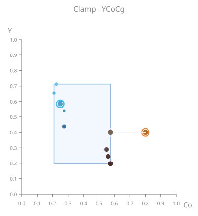
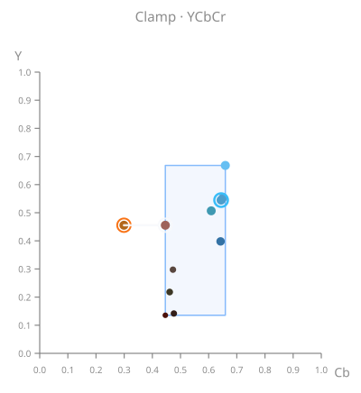
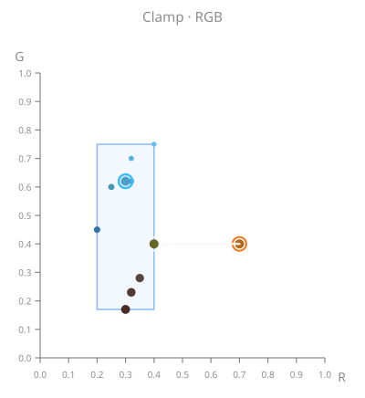

# Shades
Shades is a collection of my updated Reshade shaders.
## **Installation**
### A. ReShade installer
1. Run the [Reshade](https://reshade.me/) installer.
2. Select your target game.
3. Select the correct rendering API (DirectX 9, 10, 11, 12, OpenGL or Vulkan).
4. If you already have Reshade installed for that game select: `Update ReShade and Effects`.
5. Toggle the checkmark on `Shades`.
6. Click on next or continue to install.
### B. Manual 
If reshade is alredy installed for that game you can install the shaders manually by:
1. Locating the games executable `.exe` file. Next to it you will find folder named `./reshade-shaders` with subfolders `/Shaders` and `/Textures`.
2. Download the whole repo and drop the `/Shaders` and `/Textures` folders into the `./reshade-shaders` folder.
3. In the reshade seettings add the `/Shaders/Shades` and `/Textures/Shades` folders to the "Texture Search Paths" and "Effect Search Paths" respectively.

# Shaders *`.fx`*

## **TFAA**.*fx*
### **What it is**
**TFAA** is a purely temporal anti-aliasing component, used to get the closest thing to real temporal anti-aliasing possible in a [Reshade](https://reshade.me/) shader.

<!-- TFAA_EXMAPLE_VIDEO_START -->

*Top: SMAA · Bottom: SMAA + TFAA*

<!-- TFAA_EXMAPLE_VIDEO_END -->

<!-- TFAA_EXMAPLE_Images_START -->
<table width="100%" style="width:100%;table-layout:fixed;border-collapse:collapse;">
<tr>
<th width="18%" style="width:18%;"></th>
<th width="41%" style="width:41%;">Without SMAA</th>
<th width="41%" style="width:41%;">With SMAA</th>
</tr>
<tr>
<th align="left" valign="middle" style="text-align:left;vertical-align:middle;">Without TFAA</th>
<td valign="top" style="vertical-align:top;padding:4px;"></td>
<td valign="top" style="vertical-align:top;padding:4px;"></td>
</tr>
<tr>
<th align="left" valign="middle" style="text-align:left;vertical-align:middle;">With TFAA</th>
<td valign="top" style="vertical-align:top;padding:4px;"></td>
<td valign="top" style="vertical-align:top;padding:4px;"></td>
</tr>
</table>
<!-- TFAA_EXMAPLE_Images_END -->

### **How it works**
The most basic verion of temporal filters as in TFAA or in well known industry solutions like Filmic SMAA T1x consists of the following steps:
1. **History data** is [sampled](#history-resampling) for each pixel using the velocity buffer and accumulated history buffer.
2. **Validate** that history data is plausible and **reject** if not.
3. **Rectification** of the history data. 
    - a.) If the history data is valid, we rectify it to the neighborhood of the current frame.
    - b.) If the history data is not valid, we skip this and go straight to 5.
4. **Blending** of the new data with the rectified history data.
5. **Writing Data** of either the blendend data or the new data only into the history buffer.

### **Dependencies**
 - The **depth buffer** being available and configured correctly. (Check via DisplayDepth.fx)
 - [LAUNCHPAD](https://github.com/martymcmodding/iMMERSE/blob/main/Shaders/MartysMods_LAUNCHPAD.fx) being 
 installed with all its dependencies. (Just installl the IMMERSE shader pack when installing Reshade.)
 - Some **spatial anti-aliasing** method being run either ingame or via Reshade **before TFAA**.

### **Preprocessor controls in `TFAA.fx`**. 
These Settings are implemented as preprocessor defines instead of runtime branching for performance reasons.

|  |  |  |  |  |  |  |
|---|---|---|---|---|---|---|
| [**`TFAA_SAMPLING_METHOD`**](#history-resampling) | [**Value**]() | [**Setting**]() | [**Samples**]() | [**Quality**]() | [**Performance**]() | [**Description**]() |
|           | `0` | **BILINEAR** | 1-tap | *Ass* (1/5) | *Great* (5/5) | Hardware bilinear tap |
| *default* | `1` | **CATMULLROM** | 5-tap | *Ok* (3/5) | *Good* (4/5) | [Catmull-Rom](https://en.wikipedia.org/wiki/Catmull%E2%80%93Rom_spline) |
|           | `2` | **LANCZOS2** | 16-tap | *Ok* (3/5) | *Ok* (3/5) | [Lanczos-2](https://en.wikipedia.org/wiki/Lanczos_resampling) |
|           | `3` | **LANCZOS3** | 36-tap | *Good* (4/5) | *Bad* (2/5) | [Lanczos-3](https://en.wikipedia.org/wiki/Lanczos_resampling) |
|           | `4` | **LANCZOS4** | 64-tap | *Great* (5/5) | *Ass* (1/5) | [Lanczos-4](https://en.wikipedia.org/wiki/Lanczos_resampling) |
|           | `5` | **FSR EASU** | 12-tap | *Broken* (1/5) | *Ass* (1/5) | [AMD FidelityFX EASU](https://github.com/GPUOpen-Effects/FidelityFX-FSR)  |
|  |  |  |  |  |
| [**`TFAA_RECTIFY_COLOR_SPACE`**](#color-rectification-visualization) | [**Value**]() | [**Setting**]() | [**Channel**]() | [**Quality**]() | [**Performance**]() | [**Description**]() |
|           | `0` | RGB | **R**: Red. **G**: Green. **B**: Blue. | *Bad* (2/5) | *Great* (5/5) | No color transform (identity); loosest rectification bounds. Most blurring and most color deviation artifacts.|
|           | `1` | YCbCr | **Y**: BT.601 luma. **Cb**: blue-yellow axis. **Cr**: red-cyan axi. | *Good* (4/5) | *Good* (4/5) | ITU-R BT.601 / JPEG-style full-range chroma scales (not broadcast limited-range packing). Chrominance more correlated across axes than YCoCg; rectify path stores Cb/Cr with **+0.5** offset so all axes are in [0,1].
| *default* | `2` | YCoCg | **Y**: (R+2G+B)/4 luma. **Co**: orange-cyan axis. **Cg**: green-magenta axis. | *Great* (5/5) | *Good* (4/5) | Malvar & Sullivan (2003 YCoCg); orthogonal chroma, more decorrelated than YCbCr. Shader uses the linear-float form here (papers show integer-shift variants); rectify path stores Co/Cg with **+0.5** offset so all axes are in [0,1]. | 
|  |  |  |  |  |
| [**`TFAA_RECTIFY_OP`**](#history-rectification) | [**Value**]() | [**Setting**]() | [**Stability**]() | [**Ghosting**]() | [**Performance**]() | [**Description**]() |
|           | `0` | **CLAMP**         | *Ok* (3/5)    | *Bad* (2/5)   | *Great* (5/5)  | Clamp history to the AABB. (**`TFAA_RECTIFY_SHAPE`** is ignored). |  |
|           | `1` | **CLIP_NEAREST**  | *Great* (5/5) | *Ok* (3/5)   | *Ok* (3/5)     | Ray clip towards neighborhood sample **closest** to history in rectification space. |  |
|           | `2` | **CLIP_MEAN**     | *Good* (4/5)    | *Good* (4/5)   |  *Ok* (3/5)  | Ray clip towards the nine-tap arithmetic **average**. |  |
|           | `3` | **CLIP_CENTROID** | *Good* (4/5)    | *Good* (4/5)   |  *Ok* (3/5)  | Ray clip towards the per-channel **midpoint** `(min+max)/2`. |  |
| *default* | `4` | **CLIP_CURRENT**  | *Good* (4/5)    | *Great* (5/5) |  *Good* (4/5) | Ray clip towards the **current** pixel. |  |
|  |  |  |  |  |
| [**`TFAA_RECTIFY_SHAPE`**](#history-rectification) | [**Value**]() | [**Setting**]() | [**Shape**]() | [**Quality**]() | [**Performance**]() | [**Description**]() |
|           | `0` | **AABB** | **3**-axis **6**-faces Box |  |  | 3-axis bounding box - classic axis-aligned box used for clipping/clamping in common industry TAA solutions. |  |
| *default* | `1` | **14-DOP** | **7**-axis **14**-faces Box with cut corners |  |  | 7-axis - bounding box + corners |  |
|           | `2` | **18-DOP** | **9**-axis **18**-faces Box with cut edges |  |  | 9-axis - bounding box + edges |  |
|           | `3` | **26-DOP** | **13**-axis **26**-faces Box with cut corners and edges |  |  | 13-axis - bounding box + edges + corners |  |
|  |  |  |  |  |

 

### History Resampling

When TFAA reads **history data**, the sample position will most likely sit at a **subpixel positon**. Depending on what method is used to sample, the results can vary greatly. Cheaper methods generally blur more, expensive methods tend to preserve more detail but might also introduce more artifacts.

Below you can see some examples of how the differnt sampling methods behave when sampling at subpixel positions **0.125**, **0.25**, and **0.5**.

<!-- RESAMPLE_TABLE_START -->
<table width="100%" style="width:100%;table-layout:fixed;border-collapse:collapse;">
<tr>
<th width="14%" style="width:14%;"></th>
<th width="21.5%">0.0 offset</th>
<th width="21.5%">0.125</th>
<th width="21.5%">0.25</th>
<th width="21.5%">0.5</th>
</tr>
<tr>
<th align="left" valign="middle" style="text-align:left;vertical-align:middle;white-space:normal;">Bilinear 1 tap</th>
<td valign="top" style="vertical-align:top;padding:4px;"></td>
<td valign="top" style="vertical-align:top;padding:4px;"></td>
<td valign="top" style="vertical-align:top;padding:4px;"></td>
<td valign="top" style="vertical-align:top;padding:4px;"></td>
</tr>
<tr>
<th align="left" valign="middle" style="text-align:left;vertical-align:middle;white-space:normal;">Catmull–Rom 5 taps</th>
<td valign="top" style="vertical-align:top;padding:4px;"></td>
<td valign="top" style="vertical-align:top;padding:4px;"></td>
<td valign="top" style="vertical-align:top;padding:4px;"></td>
<td valign="top" style="vertical-align:top;padding:4px;"></td>
</tr>
<tr>
<th align="left" valign="middle" style="text-align:left;vertical-align:middle;white-space:normal;">Lanczos 2 16 taps</th>
<td valign="top" style="vertical-align:top;padding:4px;"></td>
<td valign="top" style="vertical-align:top;padding:4px;"></td>
<td valign="top" style="vertical-align:top;padding:4px;"></td>
<td valign="top" style="vertical-align:top;padding:4px;"></td>
</tr>
<tr>
<th align="left" valign="middle" style="text-align:left;vertical-align:middle;white-space:normal;">Lanczos 3 36 taps</th>
<td valign="top" style="vertical-align:top;padding:4px;"></td>
<td valign="top" style="vertical-align:top;padding:4px;"></td>
<td valign="top" style="vertical-align:top;padding:4px;"></td>
<td valign="top" style="vertical-align:top;padding:4px;"></td>
</tr>
<tr>
<th align="left" valign="middle" style="text-align:left;vertical-align:middle;white-space:normal;">Lanczos 4 64 taps</th>
<td valign="top" style="vertical-align:top;padding:4px;"></td>
<td valign="top" style="vertical-align:top;padding:4px;"></td>
<td valign="top" style="vertical-align:top;padding:4px;"></td>
<td valign="top" style="vertical-align:top;padding:4px;"></td>
</tr>
<tr>
<th align="left" valign="middle" style="text-align:left;vertical-align:middle;white-space:normal;">FSR EASU 12 taps</th>
<td valign="top" style="vertical-align:top;padding:4px;"></td>
<td valign="top" style="vertical-align:top;padding:4px;"></td>
<td valign="top" style="vertical-align:top;padding:4px;"></td>
<td valign="top" style="vertical-align:top;padding:4px;"></td>
</tr>
</table>

<strong>Show more examples</strong> — click to expand

<table width="100%" style="width:100%;table-layout:fixed;border-collapse:collapse;">
<tr>
<th width="14%" style="width:14%;"></th>
<th width="21.5%">0.0 offset</th>
<th width="21.5%">0.125</th>
<th width="21.5%">0.25</th>
<th width="21.5%">0.5</th>
</tr>
<tr>
<th align="left" valign="middle" style="text-align:left;vertical-align:middle;white-space:normal;">Bilinear 1 tap</th>
<td valign="top" style="vertical-align:top;padding:4px;"></td>
<td valign="top" style="vertical-align:top;padding:4px;"></td>
<td valign="top" style="vertical-align:top;padding:4px;"></td>
<td valign="top" style="vertical-align:top;padding:4px;"></td>
</tr>
<tr>
<th align="left" valign="middle" style="text-align:left;vertical-align:middle;white-space:normal;">Catmull–Rom 5 taps</th>
<td valign="top" style="vertical-align:top;padding:4px;"></td>
<td valign="top" style="vertical-align:top;padding:4px;"></td>
<td valign="top" style="vertical-align:top;padding:4px;"></td>
<td valign="top" style="vertical-align:top;padding:4px;"></td>
</tr>
<tr>
<th align="left" valign="middle" style="text-align:left;vertical-align:middle;white-space:normal;">Lanczos 2 16 taps</th>
<td valign="top" style="vertical-align:top;padding:4px;"></td>
<td valign="top" style="vertical-align:top;padding:4px;"></td>
<td valign="top" style="vertical-align:top;padding:4px;"></td>
<td valign="top" style="vertical-align:top;padding:4px;"></td>
</tr>
<tr>
<th align="left" valign="middle" style="text-align:left;vertical-align:middle;white-space:normal;">Lanczos 3 36 taps</th>
<td valign="top" style="vertical-align:top;padding:4px;"></td>
<td valign="top" style="vertical-align:top;padding:4px;"></td>
<td valign="top" style="vertical-align:top;padding:4px;"></td>
<td valign="top" style="vertical-align:top;padding:4px;"></td>
</tr>
<tr>
<th align="left" valign="middle" style="text-align:left;vertical-align:middle;white-space:normal;">Lanczos 4 64 taps</th>
<td valign="top" style="vertical-align:top;padding:4px;"></td>
<td valign="top" style="vertical-align:top;padding:4px;"></td>
<td valign="top" style="vertical-align:top;padding:4px;"></td>
<td valign="top" style="vertical-align:top;padding:4px;"></td>
</tr>
<tr>
<th align="left" valign="middle" style="text-align:left;vertical-align:middle;white-space:normal;">FSR EASU 12 taps</th>
<td valign="top" style="vertical-align:top;padding:4px;"></td>
<td valign="top" style="vertical-align:top;padding:4px;"></td>
<td valign="top" style="vertical-align:top;padding:4px;"></td>
<td valign="top" style="vertical-align:top;padding:4px;"></td>
</tr>
</table>

<table width="100%" style="width:100%;table-layout:fixed;border-collapse:collapse;">
<tr>
<th width="14%" style="width:14%;"></th>
<th width="21.5%">0.0 offset</th>
<th width="21.5%">0.125</th>
<th width="21.5%">0.25</th>
<th width="21.5%">0.5</th>
</tr>
<tr>
<th align="left" valign="middle" style="text-align:left;vertical-align:middle;white-space:normal;">Bilinear 1 tap</th>
<td valign="top" style="vertical-align:top;padding:4px;"></td>
<td valign="top" style="vertical-align:top;padding:4px;"></td>
<td valign="top" style="vertical-align:top;padding:4px;"></td>
<td valign="top" style="vertical-align:top;padding:4px;"></td>
</tr>
<tr>
<th align="left" valign="middle" style="text-align:left;vertical-align:middle;white-space:normal;">Catmull–Rom 5 taps</th>
<td valign="top" style="vertical-align:top;padding:4px;"></td>
<td valign="top" style="vertical-align:top;padding:4px;"></td>
<td valign="top" style="vertical-align:top;padding:4px;"></td>
<td valign="top" style="vertical-align:top;padding:4px;"></td>
</tr>
<tr>
<th align="left" valign="middle" style="text-align:left;vertical-align:middle;white-space:normal;">Lanczos 2 16 taps</th>
<td valign="top" style="vertical-align:top;padding:4px;"></td>
<td valign="top" style="vertical-align:top;padding:4px;"></td>
<td valign="top" style="vertical-align:top;padding:4px;"></td>
<td valign="top" style="vertical-align:top;padding:4px;"></td>
</tr>
<tr>
<th align="left" valign="middle" style="text-align:left;vertical-align:middle;white-space:normal;">Lanczos 3 36 taps</th>
<td valign="top" style="vertical-align:top;padding:4px;"></td>
<td valign="top" style="vertical-align:top;padding:4px;"></td>
<td valign="top" style="vertical-align:top;padding:4px;"></td>
<td valign="top" style="vertical-align:top;padding:4px;"></td>
</tr>
<tr>
<th align="left" valign="middle" style="text-align:left;vertical-align:middle;white-space:normal;">Lanczos 4 64 taps</th>
<td valign="top" style="vertical-align:top;padding:4px;"></td>
<td valign="top" style="vertical-align:top;padding:4px;"></td>
<td valign="top" style="vertical-align:top;padding:4px;"></td>
<td valign="top" style="vertical-align:top;padding:4px;"></td>
</tr>
<tr>
<th align="left" valign="middle" style="text-align:left;vertical-align:middle;white-space:normal;">FSR EASU 12 taps</th>
<td valign="top" style="vertical-align:top;padding:4px;"></td>
<td valign="top" style="vertical-align:top;padding:4px;"></td>
<td valign="top" style="vertical-align:top;padding:4px;"></td>
<td valign="top" style="vertical-align:top;padding:4px;"></td>
</tr>
</table>

<!-- RESAMPLE_TABLE_END -->

---
 

### History Rectification

<!-- RECTIFICATION_BASICS_START -->

<!-- RECTIFICATION_BASICS_END -->

<!-- RECTIFICATION_CLAMP_START -->
<table width="100%" style="width:100%;table-layout:fixed;border-collapse:collapse;">
<tr>
<th width="25%">None</th><th width="25%">RGB</th><th width="25%">YCbCr</th><th width="25%">YCoCg</th>
</tr>
<tr>
<td style="vertical-align:top;padding:4px;"></td><td style="vertical-align:top;padding:4px;"></td><td style="vertical-align:top;padding:4px;"></td><td style="vertical-align:top;padding:4px;"></td>
</tr>
</table>
<!-- RECTIFICATION_CLAMP_END -->

<!-- RECTIFICATION_ALL_START -->

<strong>Show all rectification diagrams</strong> — click to expand

<strong>CLAMP</strong> (<code>TFAA_RECTIFY_OP</code> 0)

<strong>YCoCg</strong>

<table width="100%" style="width:100%;table-layout:fixed;border-collapse:collapse;">
<tr>
<th width="25%">AABB</th><th width="25%">14-DOP</th><th width="25%">18-DOP</th><th width="25%">26-DOP</th>
</tr>
<tr>
<td style="vertical-align:top;padding:4px;"></td><td style="vertical-align:top;padding:4px;"></td><td style="vertical-align:top;padding:4px;"></td><td style="vertical-align:top;padding:4px;"></td>
</tr>
</table>

<strong>YCbCr &amp; RGB</strong> — click to expand

<strong>YCbCr</strong>

<table width="100%" style="width:100%;table-layout:fixed;border-collapse:collapse;">
<tr>
<th width="25%">AABB</th><th width="25%">14-DOP</th><th width="25%">18-DOP</th><th width="25%">26-DOP</th>
</tr>
<tr>
<td style="vertical-align:top;padding:4px;"></td><td style="vertical-align:top;padding:4px;"></td><td style="vertical-align:top;padding:4px;"></td><td style="vertical-align:top;padding:4px;"></td>
</tr>
</table>

<strong>RGB</strong>

<table width="100%" style="width:100%;table-layout:fixed;border-collapse:collapse;">
<tr>
<th width="25%">AABB</th><th width="25%">14-DOP</th><th width="25%">18-DOP</th><th width="25%">26-DOP</th>
</tr>
<tr>
<td style="vertical-align:top;padding:4px;"></td><td style="vertical-align:top;padding:4px;"></td><td style="vertical-align:top;padding:4px;"></td><td style="vertical-align:top;padding:4px;"></td>
</tr>
</table>

<strong>CLIP_NEAREST</strong> (<code>TFAA_RECTIFY_OP</code> 1)

<strong>YCoCg</strong>

<table width="100%" style="width:100%;table-layout:fixed;border-collapse:collapse;">
<tr>
<th width="25%">AABB</th><th width="25%">14-DOP</th><th width="25%">18-DOP</th><th width="25%">26-DOP</th>
</tr>
<tr>
<td style="vertical-align:top;padding:4px;"></td><td style="vertical-align:top;padding:4px;"></td><td style="vertical-align:top;padding:4px;"></td><td style="vertical-align:top;padding:4px;"></td>
</tr>
</table>

<strong>YCbCr &amp; RGB</strong> — click to expand

<strong>YCbCr</strong>

<table width="100%" style="width:100%;table-layout:fixed;border-collapse:collapse;">
<tr>
<th width="25%">AABB</th><th width="25%">14-DOP</th><th width="25%">18-DOP</th><th width="25%">26-DOP</th>
</tr>
<tr>
<td style="vertical-align:top;padding:4px;"></td><td style="vertical-align:top;padding:4px;"></td><td style="vertical-align:top;padding:4px;"></td><td style="vertical-align:top;padding:4px;"></td>
</tr>
</table>

<strong>RGB</strong>

<table width="100%" style="width:100%;table-layout:fixed;border-collapse:collapse;">
<tr>
<th width="25%">AABB</th><th width="25%">14-DOP</th><th width="25%">18-DOP</th><th width="25%">26-DOP</th>
</tr>
<tr>
<td style="vertical-align:top;padding:4px;"></td><td style="vertical-align:top;padding:4px;"></td><td style="vertical-align:top;padding:4px;"></td><td style="vertical-align:top;padding:4px;"></td>
</tr>
</table>

<strong>CLIP_MEAN</strong> (<code>TFAA_RECTIFY_OP</code> 2)

<strong>YCoCg</strong>

<table width="100%" style="width:100%;table-layout:fixed;border-collapse:collapse;">
<tr>
<th width="25%">AABB</th><th width="25%">14-DOP</th><th width="25%">18-DOP</th><th width="25%">26-DOP</th>
</tr>
<tr>
<td style="vertical-align:top;padding:4px;"></td><td style="vertical-align:top;padding:4px;"></td><td style="vertical-align:top;padding:4px;"></td><td style="vertical-align:top;padding:4px;"></td>
</tr>
</table>

<strong>YCbCr &amp; RGB</strong> — click to expand

<strong>YCbCr</strong>

<table width="100%" style="width:100%;table-layout:fixed;border-collapse:collapse;">
<tr>
<th width="25%">AABB</th><th width="25%">14-DOP</th><th width="25%">18-DOP</th><th width="25%">26-DOP</th>
</tr>
<tr>
<td style="vertical-align:top;padding:4px;"></td><td style="vertical-align:top;padding:4px;"></td><td style="vertical-align:top;padding:4px;"></td><td style="vertical-align:top;padding:4px;"></td>
</tr>
</table>

<strong>RGB</strong>

<table width="100%" style="width:100%;table-layout:fixed;border-collapse:collapse;">
<tr>
<th width="25%">AABB</th><th width="25%">14-DOP</th><th width="25%">18-DOP</th><th width="25%">26-DOP</th>
</tr>
<tr>
<td style="vertical-align:top;padding:4px;"></td><td style="vertical-align:top;padding:4px;"></td><td style="vertical-align:top;padding:4px;"></td><td style="vertical-align:top;padding:4px;"></td>
</tr>
</table>

<strong>CLIP_CENTROID</strong> (<code>TFAA_RECTIFY_OP</code> 3)

<strong>YCoCg</strong>

<table width="100%" style="width:100%;table-layout:fixed;border-collapse:collapse;">
<tr>
<th width="25%">AABB</th><th width="25%">14-DOP</th><th width="25%">18-DOP</th><th width="25%">26-DOP</th>
</tr>
<tr>
<td style="vertical-align:top;padding:4px;"></td><td style="vertical-align:top;padding:4px;"></td><td style="vertical-align:top;padding:4px;"></td><td style="vertical-align:top;padding:4px;"></td>
</tr>
</table>

<strong>YCbCr &amp; RGB</strong> — click to expand

<strong>YCbCr</strong>

<table width="100%" style="width:100%;table-layout:fixed;border-collapse:collapse;">
<tr>
<th width="25%">AABB</th><th width="25%">14-DOP</th><th width="25%">18-DOP</th><th width="25%">26-DOP</th>
</tr>
<tr>
<td style="vertical-align:top;padding:4px;"></td><td style="vertical-align:top;padding:4px;"></td><td style="vertical-align:top;padding:4px;"></td><td style="vertical-align:top;padding:4px;"></td>
</tr>
</table>

<strong>RGB</strong>

<table width="100%" style="width:100%;table-layout:fixed;border-collapse:collapse;">
<tr>
<th width="25%">AABB</th><th width="25%">14-DOP</th><th width="25%">18-DOP</th><th width="25%">26-DOP</th>
</tr>
<tr>
<td style="vertical-align:top;padding:4px;"></td><td style="vertical-align:top;padding:4px;"></td><td style="vertical-align:top;padding:4px;"></td><td style="vertical-align:top;padding:4px;"></td>
</tr>
</table>

<strong>CLIP_CURRENT</strong> (<code>TFAA_RECTIFY_OP</code> 4)

<strong>YCoCg</strong>

<table width="100%" style="width:100%;table-layout:fixed;border-collapse:collapse;">
<tr>
<th width="25%">AABB</th><th width="25%">14-DOP</th><th width="25%">18-DOP</th><th width="25%">26-DOP</th>
</tr>
<tr>
<td style="vertical-align:top;padding:4px;"></td><td style="vertical-align:top;padding:4px;"></td><td style="vertical-align:top;padding:4px;"></td><td style="vertical-align:top;padding:4px;"></td>
</tr>
</table>

<strong>YCbCr &amp; RGB</strong> — click to expand

<strong>YCbCr</strong>

<table width="100%" style="width:100%;table-layout:fixed;border-collapse:collapse;">
<tr>
<th width="25%">AABB</th><th width="25%">14-DOP</th><th width="25%">18-DOP</th><th width="25%">26-DOP</th>
</tr>
<tr>
<td style="vertical-align:top;padding:4px;"></td><td style="vertical-align:top;padding:4px;"></td><td style="vertical-align:top;padding:4px;"></td><td style="vertical-align:top;padding:4px;"></td>
</tr>
</table>

<strong>RGB</strong>

<table width="100%" style="width:100%;table-layout:fixed;border-collapse:collapse;">
<tr>
<th width="25%">AABB</th><th width="25%">14-DOP</th><th width="25%">18-DOP</th><th width="25%">26-DOP</th>
</tr>
<tr>
<td style="vertical-align:top;padding:4px;"></td><td style="vertical-align:top;padding:4px;"></td><td style="vertical-align:top;padding:4px;"></td><td style="vertical-align:top;padding:4px;"></td>
</tr>
</table>

<!-- RECTIFICATION_ALL_END -->

# LICENSE
- License File: [LICENSE.md](./LICENSE.md)
- Human-readable summary of the License: https://creativecommons.org/licenses/by-nc-nd/4.0/
- Full legal code: https://creativecommons.org/licenses/by-nc-nd/4.0/legalcode

